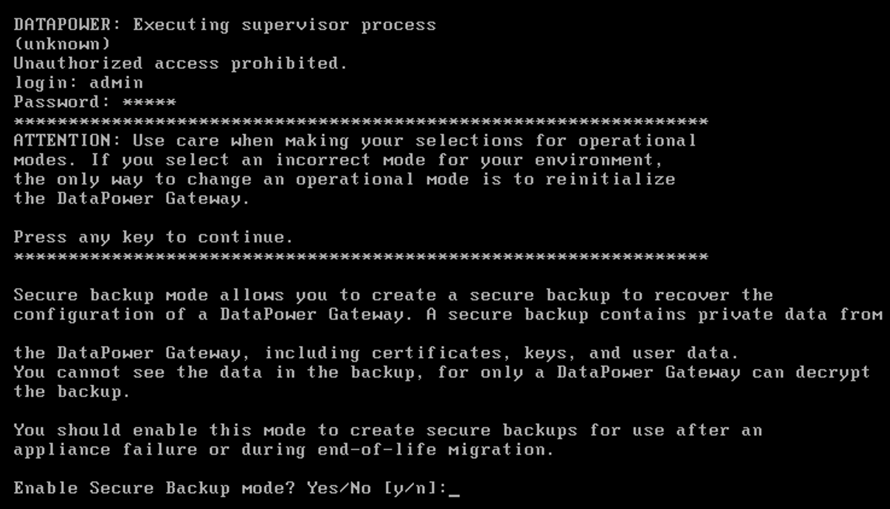
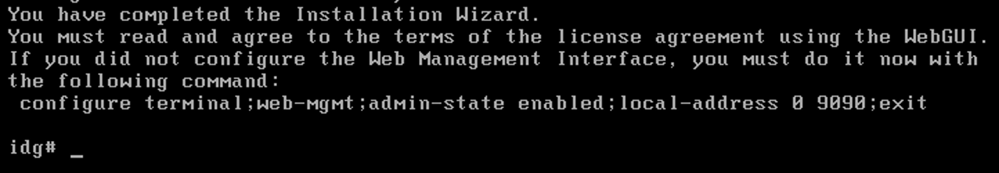
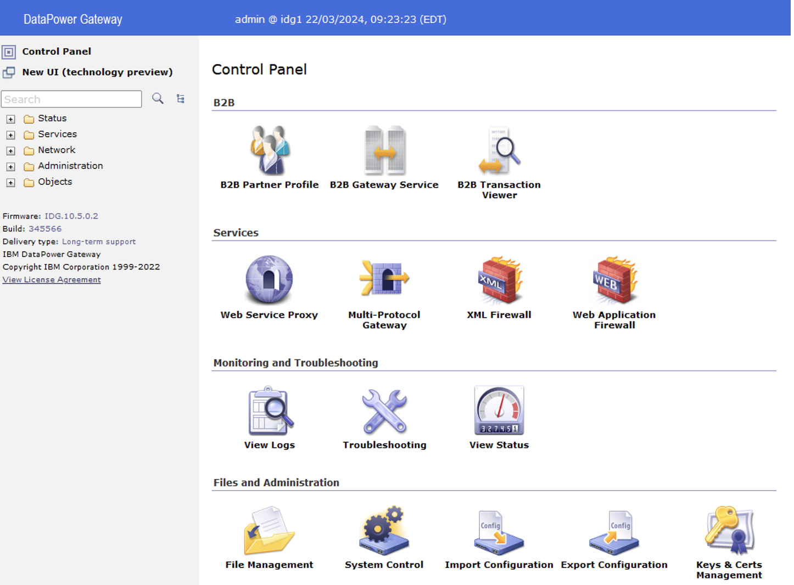
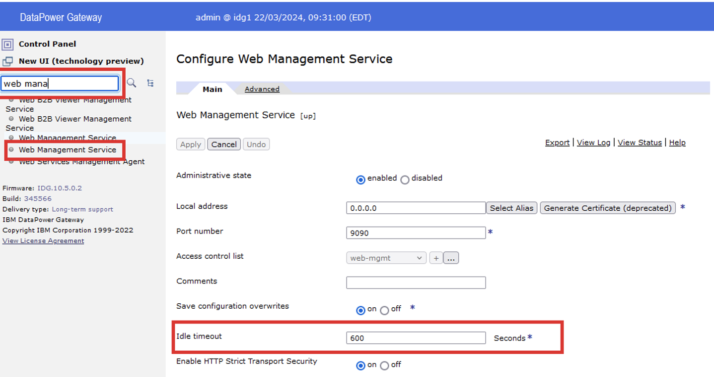

# Instalacja i inicjalizacja bramki DPG

## Wersje DataPower do pobrania z repozytorium IBM

Istnieją trzy podstawowe wersje obrazów VMWare bramy DataPower, które można pobrać i zainstalować w środowisku wirtualizacyjnym:

1. DataPower Gateway for Production
2. DataPower Gateway for Non-Production
3. DataPower Gateway for Developers

Powyższe wersje różnią się od siebie **sposobem licencjonowania**, a także **modułami dodatkowymi**, które w wersji „for Developers” są dostępne i aktywowane, a w wersji Non-Production & Production mogą wymagać włączenia i aktywowania. Pełna lista modułów w zależności od wersji znajduje się pod tym [linkiem w dokumentacji IBM](https://www.ibm.com/docs/en/datapower-gateway/10.5.x?topic=management-available-modules-by-product).

## Pierwsze uruchomienie maszyny DataPower Gateway

Twoja maszyna wirtualna IBM DataPower Gateway jest gotowa do pierwszego uruchomienia na laptopie laboratoryjnym. Otwórz aplikacje VMWare Worksataion z pulpitu i wykonaj następujące kroki:

1. Upewnij się, że jesteś w zakładce maszyny wirtualnej `datapower-vm` i wcisnąć link oznaczony jako `Power on this virtual machine`
2. Rozpocznie się proces uruchamiania maszyny, a w nim konfiguracja najważniejszych parametrów DataPower Gateway.


3. Proces uruchamiania maszyny DataPower powinien się zatrzymać prosząc użytkownika o wprowadzenie domyślnych danych do logowania. Należy wpisać:

```
login: admin
password: admin
```

4. Po pomyślnym zalogowaniu, uruchamia się konfigurator, który przeprowadzi nam przez najważniejsze parametry systemu DataPower, które należy ustawić na samym początku.



5. W kolejnych krokach będziesz pytany o:

```
1.	Enable Secure Backup mode?: Y
2.	Confirm Secure Backup mode?: Y
3.	Enable Common Criteria Compability mode?: N
4.	Please enter new password: P@ssw0rd!
5.	Please re-enter new password to confirm: P@ssw0rd!
6.	Do you want to run the Installation Wizard? Y
7.	Step 1
8.	Do you want to configure network interfaces? Y
9.	Do you have this information? Y
10.	Do you want to configure the eth0 interfaces? Y
11.	Do you want to enable DHCP? Y
12.	Do you want to configure eth1 interface? N
13.	Do you want to configure eth2 interface? N
14.	Do you want to configure eth3 interface? N
15.	Step 2
16.	Do you want to configure network services? Y
17.	Do you want to configure DNS? N
18.	Do you want to define a unique system identified for the appliance? Y
19.	Enter a unique system identifier: idg1
20.	Do you want to configure remote management interface? Y
21.	Do you have this information? Y
22.	Do you want to enable SSH? Y
23.	Enter the local IP address [0 for all]: 0
24.	Enter the port number [22]: 22
25.	Do you want to enable WebGUI access? Y
26.	Enter the local IP address [0 for all]: 0
27.	Enter the port number [9090]: 9090
28.	Step 5
29.	Do you want to configure a user account that can reset passwords? N
30.	Step 6
31.	Do you want to configure the RAID array? N
32.	Step 7
33.	Do you want to review the current configuration? Y
34.	Do you want to save current configuration? Y
35.	Overwrite previously saved configuration? Y
```


6. Po zapisaniu konfiguracji, użytkownik jest proszony o akceptację umowy licencyjnej za pomocą interfejsu graficznego.



7. Aby dostać się przez przeglądarkę do interfejsu graficznego musimy poznać adres IP jaki został przydzielony maszynie DataPower poprzez DHCP. Pozostając w terminalu należy wykonać następujące komendy:

```
configure
show interface
```


8. Na stacji roboczej z której Panstwo korzystacie, adres IP może mieć inną wartość. Należy ją zapisać i wprowadzić do przeglądarki internetowej w postaci:

```
    https://adresIP:9090
```

Korzystając z przykładu powyżej, URL do interfejsu graficznego będzie następujący:

    https://192.168.226.129:9090


9. Przeglądarka ostrzeże przed niezaufanym certyfikatem. Należy zignorować tę informację i mimo to otworzyć stronę.


10. Zaloguj się, używając zmienionego wcześniej hasła:

```
Username: admin
Password: P@ssw0rd!
```

11. Następnie przejrzyj umowę licęcyjną i ją zaakceptuj.


12. Nie zamykaj żadnego z okien, poczekaj dłuższą chwilę (ok. 1 minuty). W tym czasie, maszyna DataPower aktywuje swoje wewnętrzne mechanizmy, aby za chwilę być gotowa to pracy.


13. W kolejnym kroku pojawia się ponownie ekran logowania. Należy wpisać te same dane:

```
Username: admin
Password: P@ssw0rd!
```

14. Pierwsze logowanie po akceptacji licencji również trwa trochę dłużej (ok. 20-40 sekund), a nastęnie użytkownik zostaje przeniesiony do ekranu głównego interfejsu DataPower. 



## Podstawowe kroki administracyjne po pierwszym zalogowaniu

Na tym etapie warto wykonać tych kilka podstawowych czynności administracyjnych:

1.	Wydłużenie czasu nieaktywności w interfejsie graficznym (na środowiskach deweloperskich i ewentualnie nie-produkcyjnych)
2.	Ustalenie własnych certyfikatów w interfejsie graficznym GUI

### Wydłużenie czasu nieaktywności w interfejsie graficznym

Aby zwiększyć ergonomię pracy w trakcie tego szkolenia dobrym pomysłem jest wydłużenie czasu nieaktywności interfejsu graficznego. Standardowo, użytkownik zostanie wylogowany po 600 sekundach co jest wartością właściwą wszędzie tam gdzie zależy nam na bezpieczenstwie. 

1. Na środowiskach deweloperskich lub szkoleniowych lepiej jest jednak wydłużyć ten czas na przykład do wartości 6000 sekund czyli 100 min. W tym celu w wyszukiwarce wpisz:

```
web management
```



2. Zmień wartość parametru: `Idle timeou`t z 600 na 6000 [seconds]

3. Dodatkowo w zakładce `Advanced` mamy możliwość wgrania własnych certyfikatów (Custom TLS server profile), którymi DataPower będzie się przedstawiał użytkownikom w przeglądarce. 

Po wykonaniu zmian, należy wcisnąć przycisk `Apply`, a następnie w prawym górnym rogu `Save Configuration`.


> [!WARNING]
> Wszystkie zmiany jakie wprowadzamy przyciskami `Apply` są zapisywane w pamięci RAM urządzenia i aplikowane natychmiast. Wciśnięcie linku `Save Configuration` powoduje permanentne zapisanie tych zmian na dyskach DataPower-a. 

### Ustalenie własnych certyfikatów w interfejsie graficznym GUI

W tym samym miejscu (Web Management Service), na zakładce Advance mamy możliwość podmiany domyśnych certyfikatów prezentowanych przeglądarce przez serwer DataPower w konsoli graficznej. Nie będziemy ich teraz tutaj zmieniać, ale warto pamiętać, że jest to jedna z pierwszych rzeczy jakie wykonuje się po inicjalizacji nowej maszyny z urządzeniem DataPower.


## Podsumowanie

Ten skrypy przeprowadza Administratora przez pierwsze kroki związane z uruchomieniem urządzenia DataPower w środowisku VMWare.

