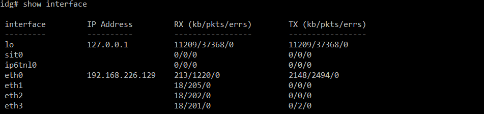
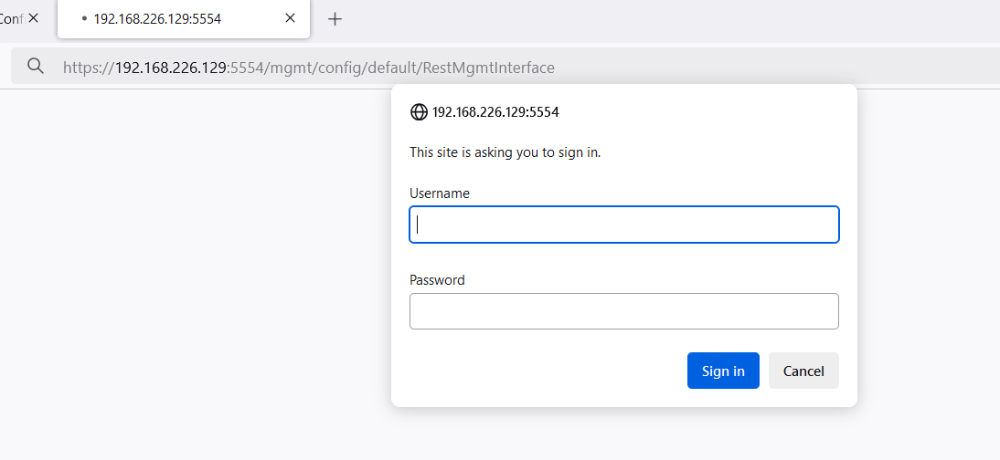
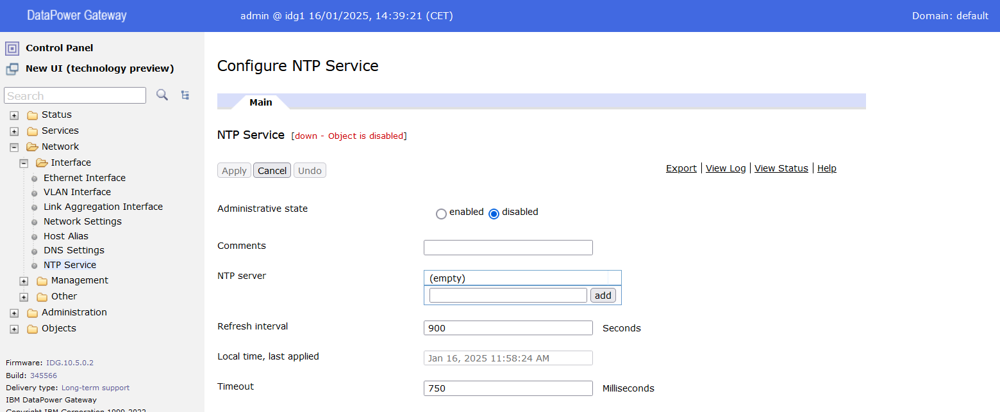
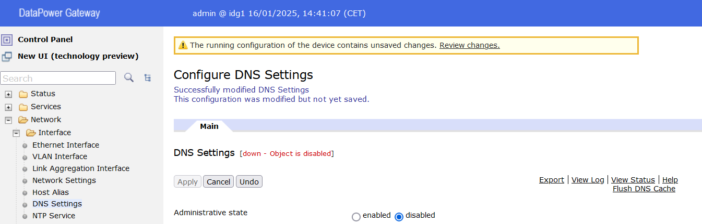

# Zapoznanie się z interfejsem administracyjnym IDG

> [!WARNING]
> Na poniższych przykładach i zrzutach ekranów IP DataPower jest 192.168.226.129, we wszystkich ćwiczeniach należy wykorzystać adres IP swojego DPG.

## Zarządzanie z wykorzystaniem CLI

1. Otwórz terminal i zaloguj się do interfejsu CLI via SSH, wpisując:

```ssh 192.168.226.129```


2. Sprawdź status usługi SSH, wpisując:

```show ssh```


3. Sprawdź status usługi WebUI, wpisując:

```show web-mgmt```


4. Sprawdź interfejsy sieciowe, wpisując:

```show interface```



5. Sprawdź skonfigurowane adresy IP, wpisując:

```show ipaddress```


6. Sprawdź konfigurację DNS wpisując:

```
show dns
show name-servers
```


7. Zweryfikuj czy serwer DNS jest dostępny, wpisując:


```
ping 192.168.226.2
```


8. Wyświetl zawartość lokalnego katalogu i katalogu z konfiguracjami, wpisując:

```
config
dir local:
dir config:
exit
```


## Wykorzystanie REST API do zarządzania IDG

1. Z poziomu CLI uruchom zarządzanie via REST, po ok 1-2 min interfejs będzie dostępny pod wskazanym adresem i portem. Wykonaj serię komend:

```
config
rest-mgmt
show
admin-state enabled
exit
write memory
y
exit
```


2. Uruchom przeglądarkę i wywołaj adres REST (adres IP i port), przykładowy adres: `https://192.168.226.129:5554`


3. Wyświetl listę dostępnych endpoint'ów dla parametrów konfiguracji w interfejsie REST.

```https://192.168.226.129:5554/mgmt/config/```


4. Wyświetl konfigurację usługi rest-mgmt

```https://192.168.226.129:5554/mgmt/config/default/RestMgmtInterface/RestMgmt-Settings```

5. Przy pierwszym uruchomieniu zastrzeżonego URL należy najpierw zalogować się (użytkownik: `admin`, hasło: `P@ssw0rd!`).



6. Następnie wyświetli się sformatowana odpowiedź JSON konfiguracji usługi rest-mgmt:


### Zmiana TimeZone dla domyślnej domeny korzystając z REST.

1. Otwórz aplikację SopeUI (skrót na Pulpicie).
2. Stwórz nowy projekt REST i wpisz URI: `https://192.168.226.129:5554`.
3. Dla każdego zapytania należy ustawić metodę uwierzytelnienia (**Auth**) na **Basic** i podać użytkownika `admin` i hasło `P@ssw0rd!`.
4. Sprawdź aktualny status daty i czasu (ustawienia domyślne):

```GET /mgmt/status/default/DateTimeStatus```


5. Sprawdź aktualne ustawienia strefy czasowej:

```GET /mgmt/config/default/TimeSettings/Time```


6. Ustaw strefę czasową na naszą:

```PUT /mgmt/config/default/TimeSettings/Time/LocalTimeZone```

Payload (application/json):

```{"LocalTimeZone": "CET-1CEST"}```


7. Ponownie sprawdź aktualny status daty i czasu, ustawiony będzie nowy TimeZone:

```GET /mgmt/status/default/DateTimeStatus```


8. Zapisz nową konfigurację domeny:

```POST /mgmt/actionqueue/default```

Payload: `{"SaveConfig" : "0"}`


## DataPower WebUI

1. Zaloguj się do interfejsu Web DataPower: `https://192.168.226.129:9090`, korzystając z loginu i hasła:

```
Username: admin
Password: P@ssw0rd!
```


2. Zweryfikuj ustawienia strefy czasowej, w oknie wyszukiwania wpisać `Time Sett` i wybrać menu. Jeżeli ustawienia są inne niż `CET (Central Europe Time)` to zmienić na nie.


3. Wejdź na ustawienia usługi `Network -> Interface -> NTP service` i upewnić się, że jest wyłączona.



4. W tym samym drzewie nawigacji wejść w DNS settings i wyłączyć usługę, przestawić `Administrative state` na `disabled` i zaaplikuj zmiany.



5. Wrócić do głównego ekranu klikając `Control Panel`, a następnie przejść do `System Control`.


6. "Zepsuj" czas, cofając go np. o 4 godziny.


7. Wróć do ustawień `NTP Service`, dodaj nowy serwer `time.google.com` oraz włączyć `Administrative state (enabled)`. Potwierdź zmiany (`Apply`). Przy okazji zweryfikować na górnej belce, czy mamy "zepsuty" czas. Po akceptacji zmian, status usługi będzie nieaktywny, bo nie może rozwiązać nazwy serwera (wcześniej wyłączyliśmy konfigurację DNS).


8. Wróć do ustawień DNS i włączyć usługę (zaaplikuj zmiany). Czas na belce będzie jeszcze błędny.


9. Wróć do ustawień `NTP service`, czas powinien być prawidłowy oraz usługa NTP powinna być uruchomiona.


10. Pamiętaj, aby zapisać zmiany dokonane w konfiguracji IDG, klikając `Save Configuration`.


