# Zarządzanie IBM DataPower Gateway

> [!WARNING]
> Wszystkie ćwiczenia wykonujemy w kontekście użytkownika "admin", chyba że będzie napisane inaczej.

## Domeny aplikacyjne – zarządzanie uprawnieniami

1. Wybierz z menu `Application domain` z drzewa `Administration -> Configuration`.
2. Kliknij `Add`, aby dodać nową domenę.

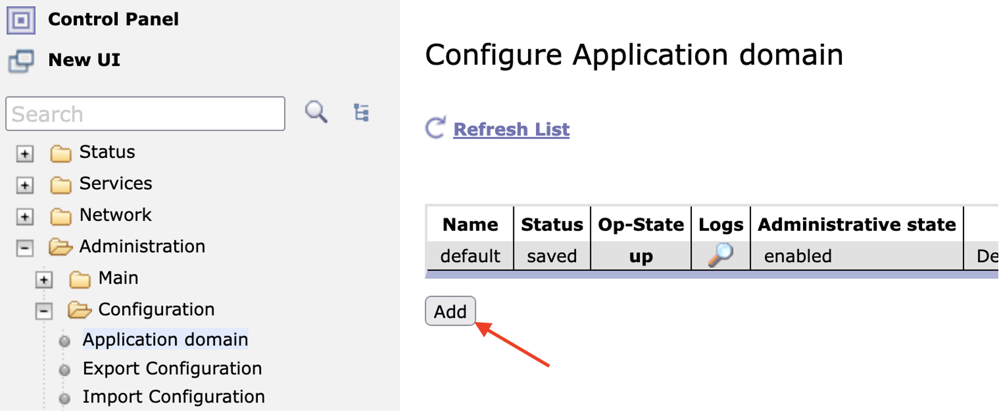

3. Dodaj domenę o nazwie `dev`, z pola `Visible domains` usuń domenę domyślną, resztę ustawień pozostawić bez zmian. Zaaplikuj zmiany i zapisz konfigurację.

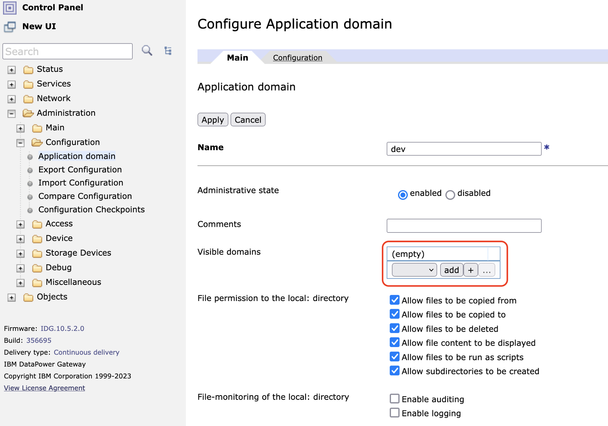

4. Wróć do głównego ekranu i wejdź w zarządzanie plikami (`File Management`).

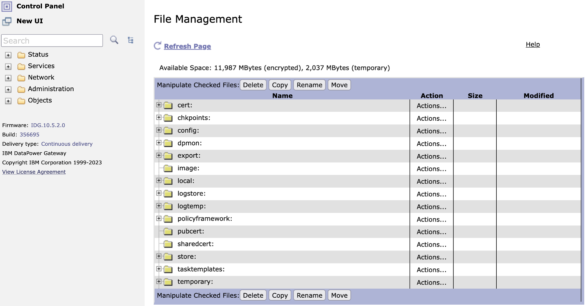

5. Przełącz się na domenę `dev`.

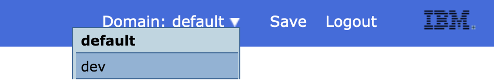

6. Po przełączeniu się na nową domenę aplikacyjną automatycznie zostałes przekierowany do głównego ekranu. Wejdź ponownie z zarządzanie plikami i porównaj widoczność plików/katalogów. Pliki z domeny `default` nie są widoczne w kontekście domeny `dev`.

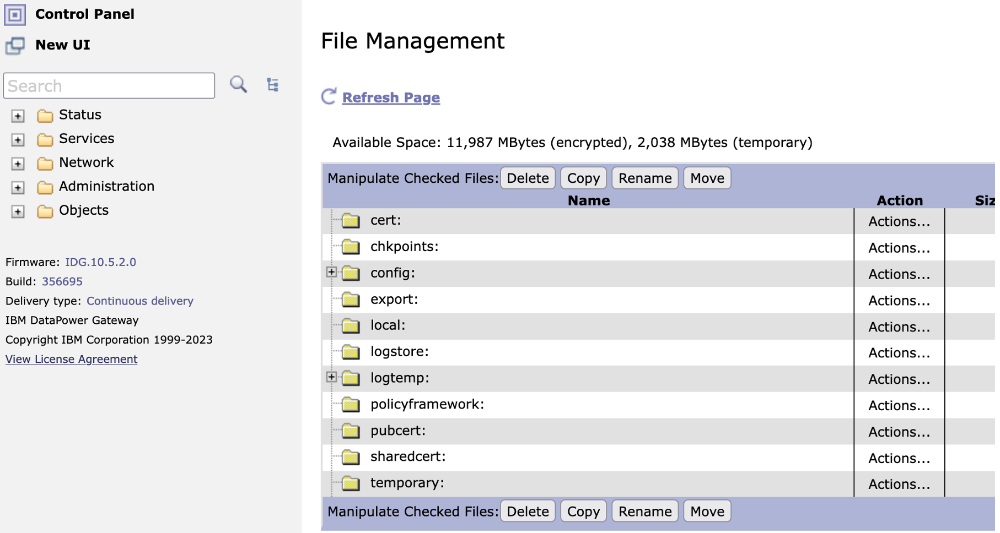

7. Wróć do zarządzania domenami aplikacyjnymi (wcześniej przełączając się na domyślną domenę `default`).

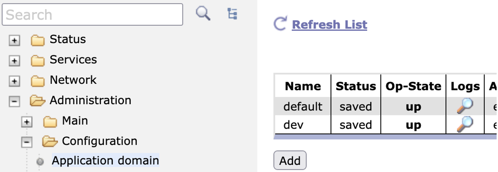

8. Wyświetl szczegóły domeny `dev` (klikając na nazwę domeny), a następnie dodaj widoczność domeny `default`. Zaaplikuj i zapisz zmiany.

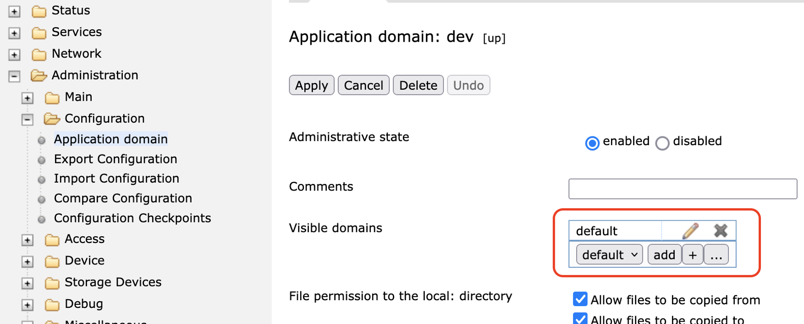

9. Dodaj nową domenę o nazwie `tst`, a w widoczności domen dodaj obie domeny, zarówno `default` jak i `dev`. Pozostałe parametry pozostaw bez zmian. Zaaplikuj i zapisz zmiany.

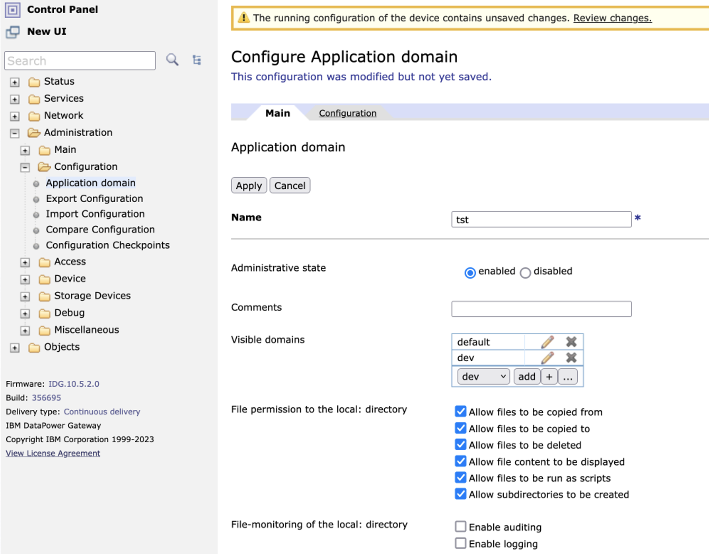

10. Uruchom zarządzanie plikami w domenie `default`. Zwrócić uwagę na widoczność podkatalogów `dev` i `tst` w wielu katalogach.

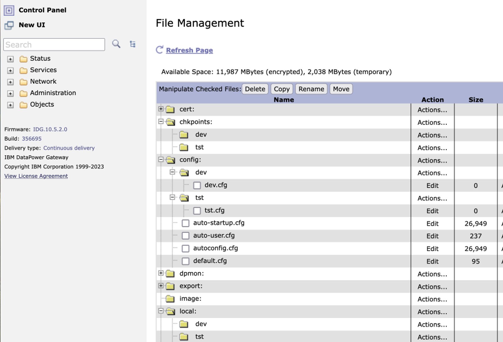

11. Porównaj listę katalogów w domenie `dev`, gdy została dodana widoczność z domyślnej domeny. Pojawił się `store:`.

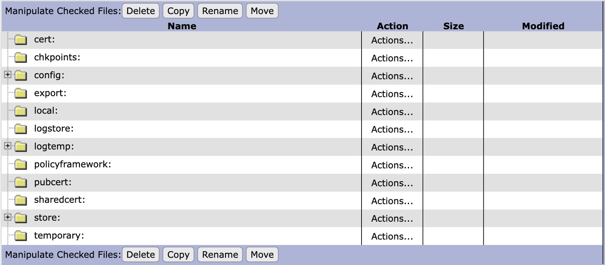

12. Natomiast w domenie `tst`, mamy dodatkowo widoczny  folder `dev:`.

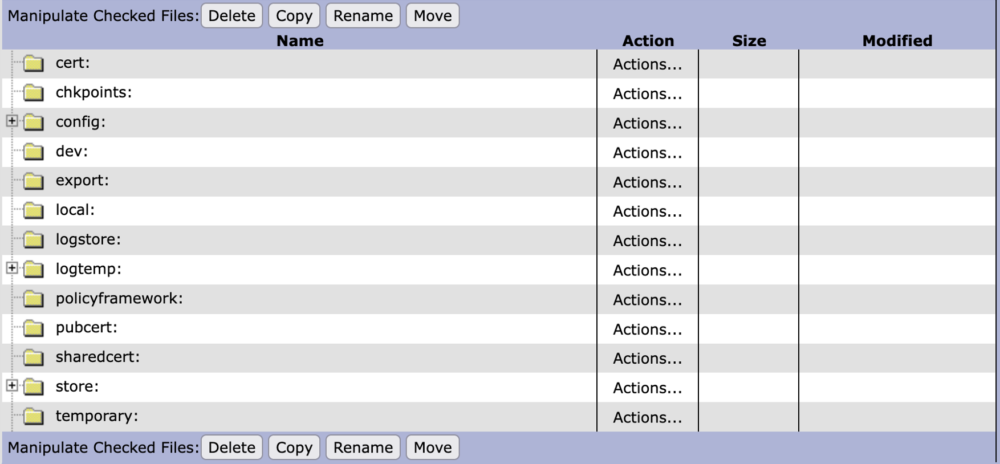

## Tworzenie i zarządzanie użytkownikami w IDG

1. Z menu wybierz `RBM settings` znajdujące się w `Administration -> Access`. Przejrzyj dostępne opcje w dostępnych zakładkach niczego nie modyfikując.


2. Przejdź do `User Group` w tej samej gałęzi menu i załóż nową grupę klikając `Add`.

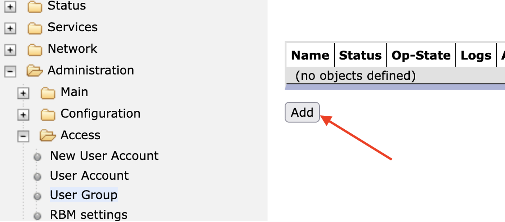

3. Nadaj nazwę `grp-dev-full` dla nowej grupy i usuń z `Access policies` istniejące polityki, a następnie wejdź w budowanie nowych polityk.

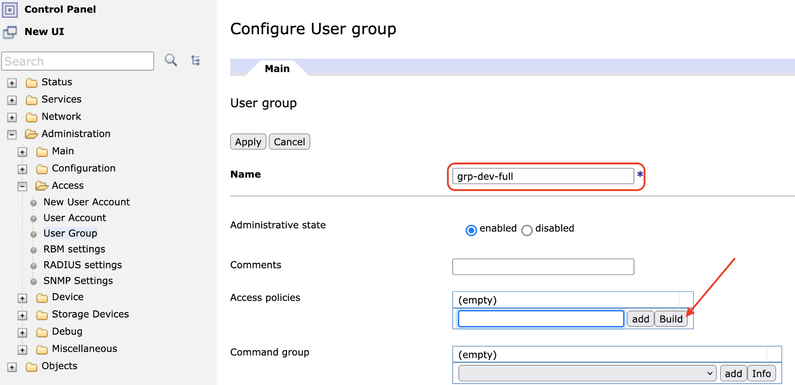

4. Tworząc nową politykę wybierz domenę aplikacyjną `dev` oraz nadaj jej wszystkie uprawnienia. Zapisz swój wybór.

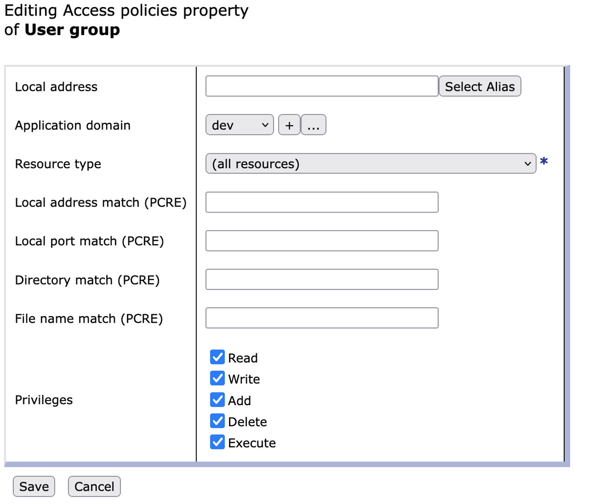

5. Po zapisie automatycznie zostanie dodana nowa polityka o wartości `*/dev/*?Access=r+w+a+d+x` nadająca członkom tej grupy pełne uprawnienia do domeny `dev`. Zaaplikuj zmiany.

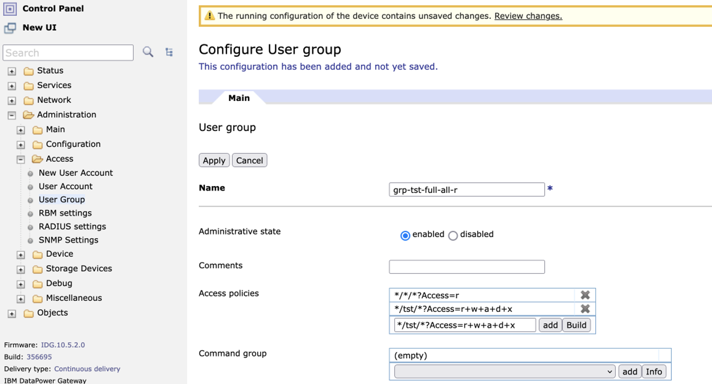

6. Dodaj nową grupę o nazwie `grp-tst-full-all-r`. Dla nowej grupy pozostaw uprawnienia odczytu dla wszystkich obiektów oraz nadaj pełne uprawnienia do domeny `tst`. Zaaplikuj i zapisz zmiany.

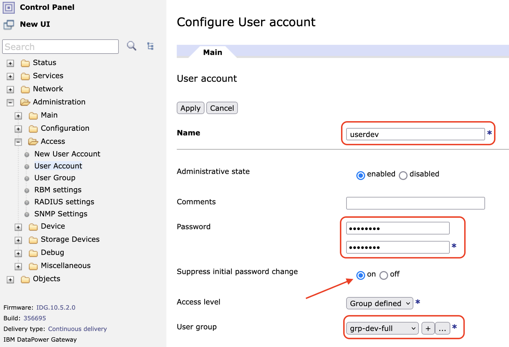

7. W następnym kroku założysz dwóch nowych użytkowników i przypiszesz im utworzone grupy. Wejdź w `User Account` i dodaj pierwszego użytkownika o nazwie `userdev`, ustaw hasło, wybierz opcję `Suppress initial…`, aby nie musieć zmieniać hasła przy pierwszym logowaniu i na koniec ustawić grupę `grp-dev-full`.

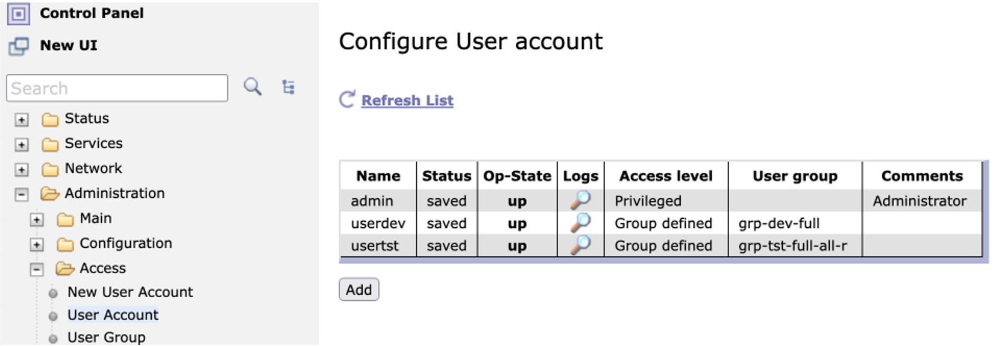

8. Dodaj drugiego użytkownika o nazwie `usertst` przypisując do grupy `grp-tst-full-all-r`.

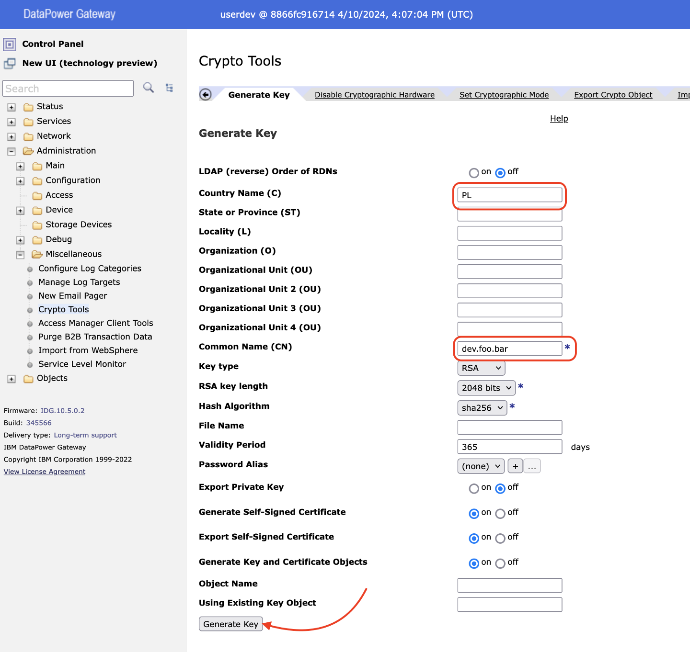

9. Wyloguj się i spróbuj zalogować się na użytkownika userdev do domeny `default`. Próba logowania zakończy się niepowodzeniem, ponieważ grupa do której przypisany jest użytkownik ma wyłącznie uprawnienia tylko do domeny `dev`.

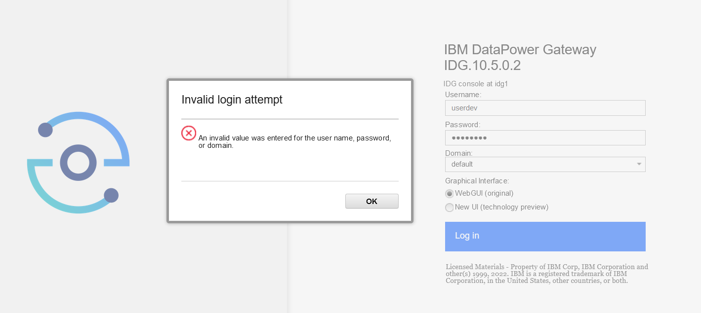

10. Zaloguj się użytkownikiem `userdev` do domeny `dev`. Zwrócić uwagę, że użytkownik nie ma możliwości zmiany domeny.

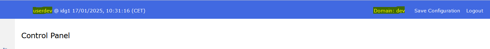

11. Zaloguj się użytkownikiem `usertst` do domeny `default`. Ponieważ grupa, do której należy użytkownika `usertst` ma uprawienia odczytu do wszystkich obiektów w każdej domenie, to logowanie będzie pomyślne. Również dostępna jest opcja zmiany domeny.


## Zarządzanie certyfikatami oraz konfiguracja połączeń TLS

W kolejnych krokach utowrzysz wszystkie obiekty potrzebne do uruchomienia połączenia TLS:

- wygenerujesz self-signed certyfikat
- utowrzysz obiekt klucza prywatnego
- utowrzysz certyfikat i klucz oraz CA potrzebne do zestawienia połączenia TLS
- utworzysz profil serwera TLS i powiązanych certyfikatów

Na koniec utworzysz prostą usługę, która będzie korzystała z powyższych.

Tym razem wszystkie działania będą wykonywane w kontekście użytkownika `userdev` i odpowiadającej mu domenie.

1. Zaloguj się na użytkownika `userdev` do domeny `dev`, a następnie z menu wybierz `Crypto Tools` w `Administration -> Miscellaneous`.
2. Wygeneruj nowy certyfikat podając w polu `Country Name` wartość `PL` oraz w `Common Name` wartość `dev.foo.bar`. Wygeneruj certyfikat klikając `Generate Key`.

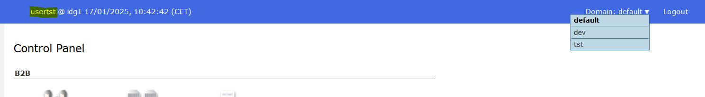

3. Potwierdź generowanie kluczy i certyfikatu do podpisu (CSR).

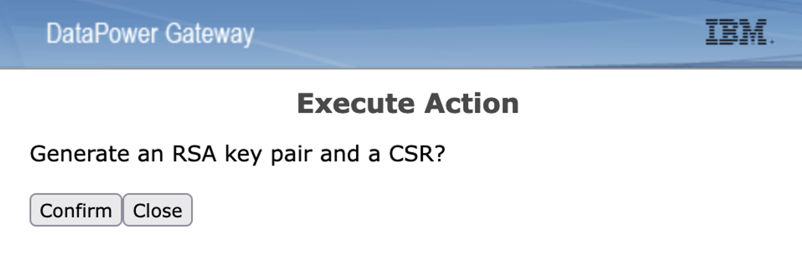

4. Certyfikat został wygenerowany – zwróć uwagę na lokalizację.

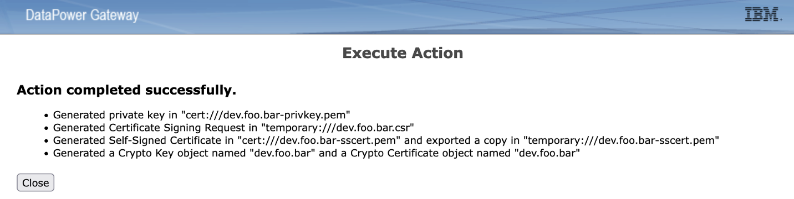

5. Z głównego menu uruchom zarządzanie plikami i sprawdzić szczegóły certyfikatu:

Z głównego menu uruchomić zarządzanie plikami i sprawdzić szczegóły certyfikatu

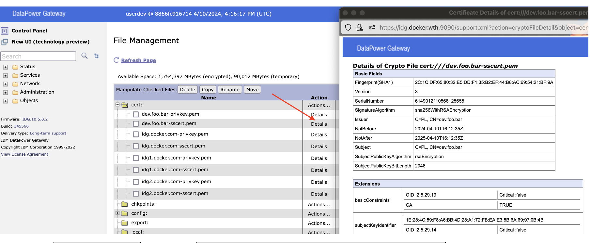

6. Wybierz `Crypto Key` z menu `Objects -> Crypto Configuration` i wejdź w szczegóły klucza dla wygenerowanego certyfikatu. Obiekt został utworzony automatycznie przy generowaniu certyfikatu, ale w przypadku importowania "zewnętrznych" certyfikatów należy go utworzyć ręcznie.

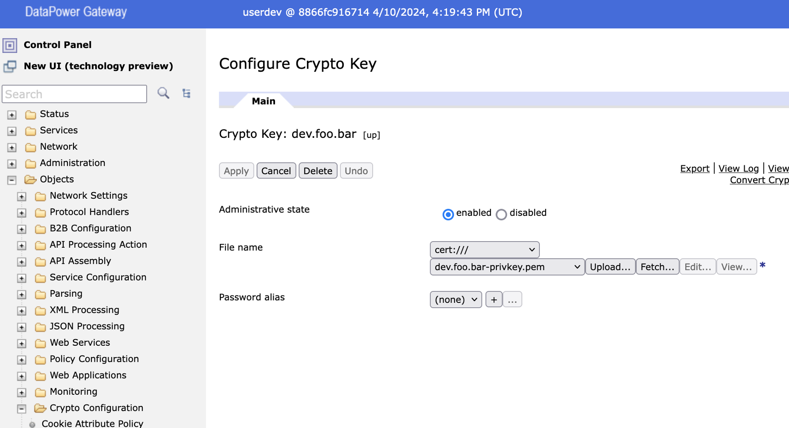

7. Wybierz `Crypto Identification Credentials` z tego samego menu i dodać nowy o nazwie `dev.foo.bar` oraz wybrać certyfikaty jak poniżej. Zaaplikuj zmiany.

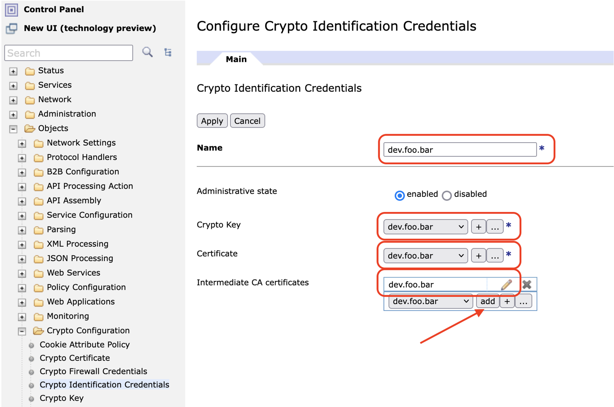

8. Wybierz `TLS Server Profile` również znajdujący się w obecnym drzewie menu i dodaj nowy profil o nazwie `dev-tls-srv-profile` wybierając `Identification Credentials` na utworzony przed chwilą obiekt. Zaaplikuj zmianę i następnie zapisz całą konfigurację.

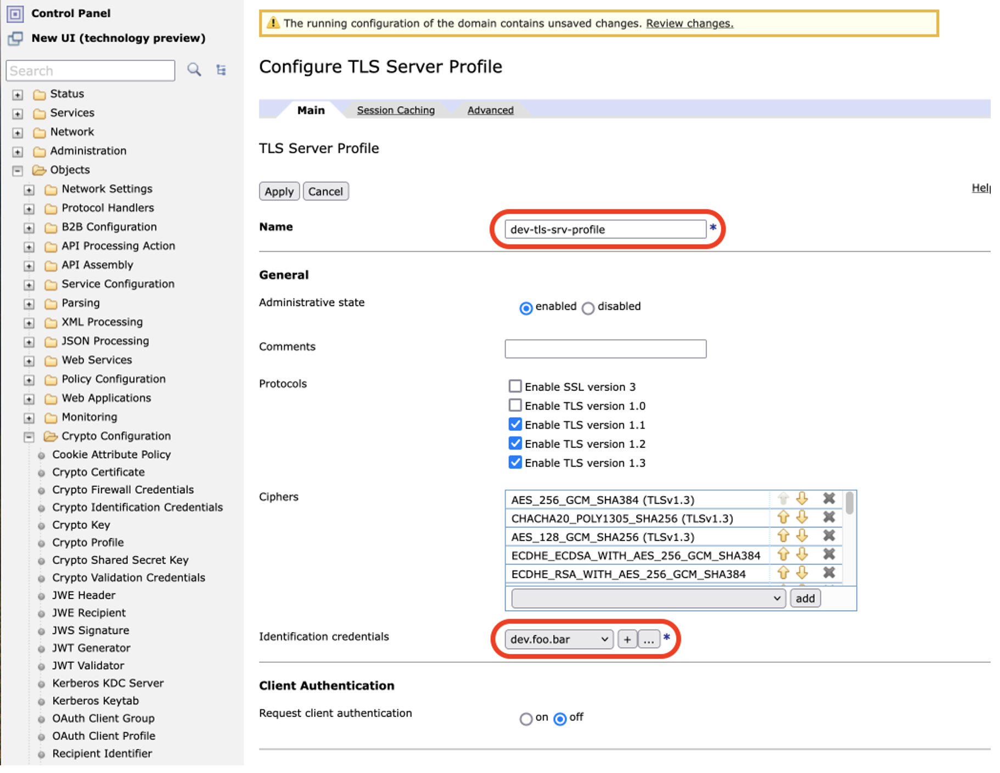

9. Utworzyłeś już profil `TLS serwera`, możesz przejść do tworzenia prostej usługi. Wróć do głównego menu i wybierz `XML Firewall`.

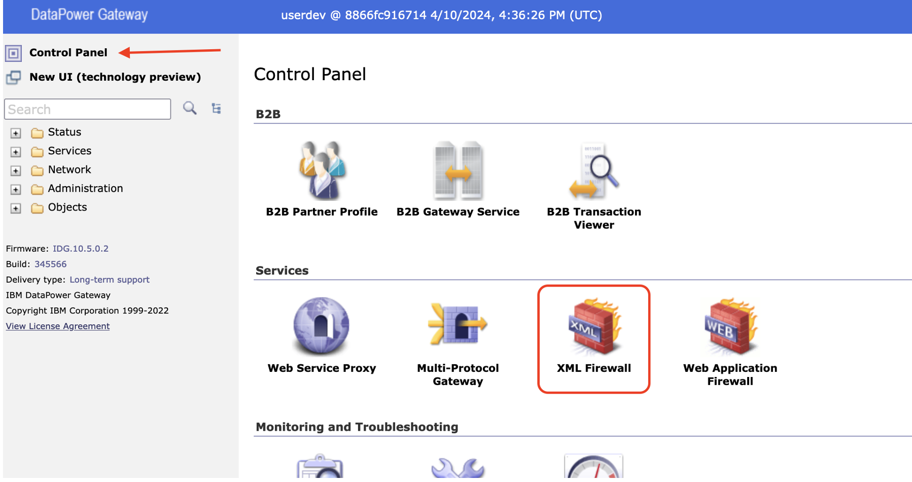

10. Wybierz opcje `Add Advanced`.

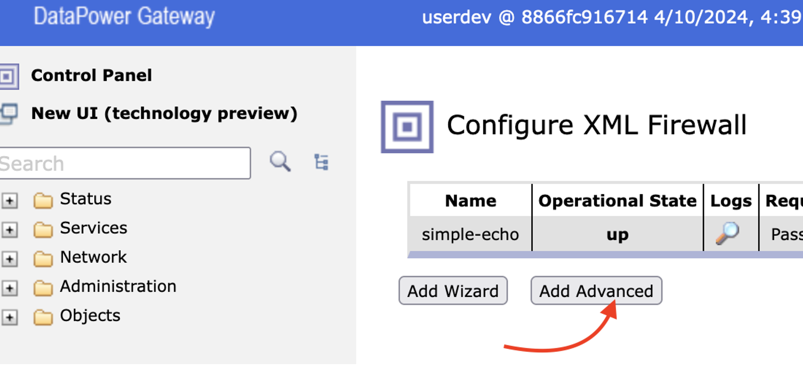

11. Utwórz nową usługę o poniszych parametrach:

- nazwa: `dev-echo`
- typ: `Loopback`
- TLS type: `Server profile`
- polityka procesowania: `default`
- profile serwera TLS: `dev-tls-srv-profile`
- port: wybrać niezajęty port (np. `8080`)
- typ zapytania: `Pass through`

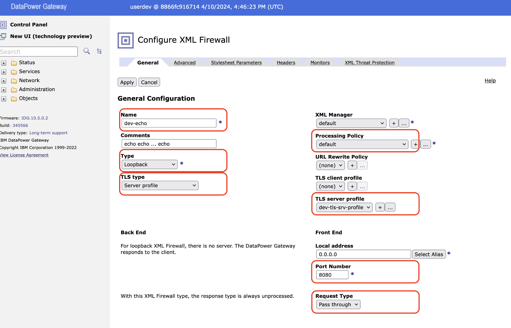

12. Zaaplikuj zmiany i zapisz konfiguracje.
13. Przetestuj, czy nowa usługa przedstawia się wygenerowanym certyfikatem. Korzystając z przeglądarki internetowej połącz się na adres IP i port (8080) z wykorzystaniem protokoły HTTPS i podejrzyj certyfikat.

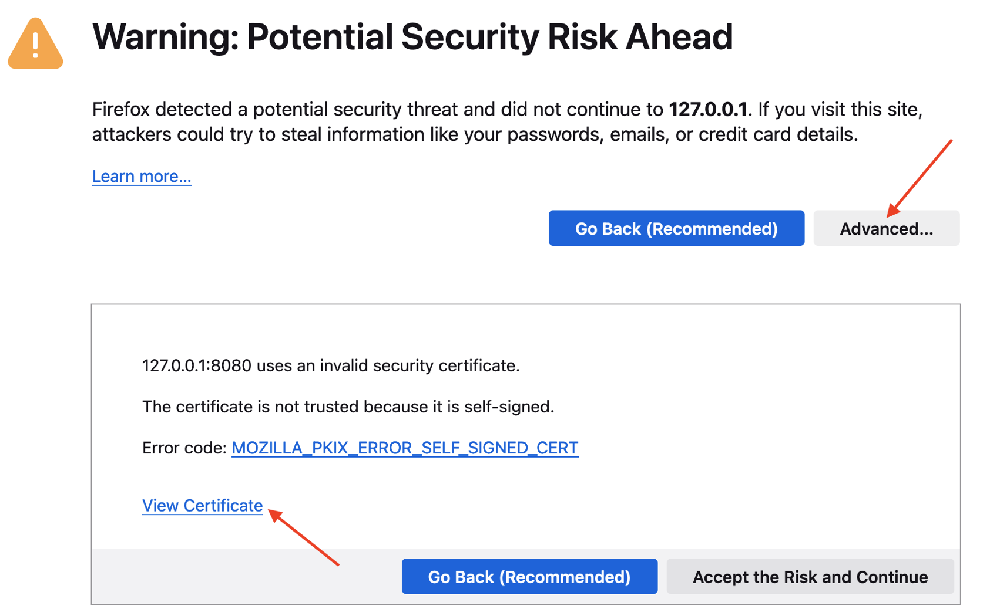

14. Otworzy się nowa zakładka ze szczegółami certyfikatu.

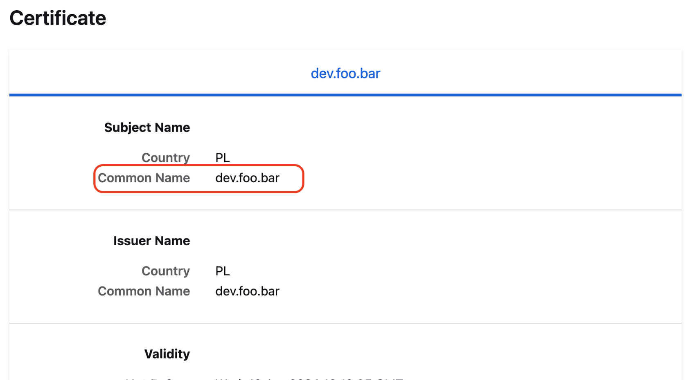

15. Możesz również sprawdzić usługę korzystając z SoapUI. Też otrzymasz certyfikat, a usługa odpowie nam "echem" - po otrzymaniu odpowiedzi przejdź na zakładkę `SSL Info`, aby wyświetlić certyfikat jakim serwer się przedstawił.

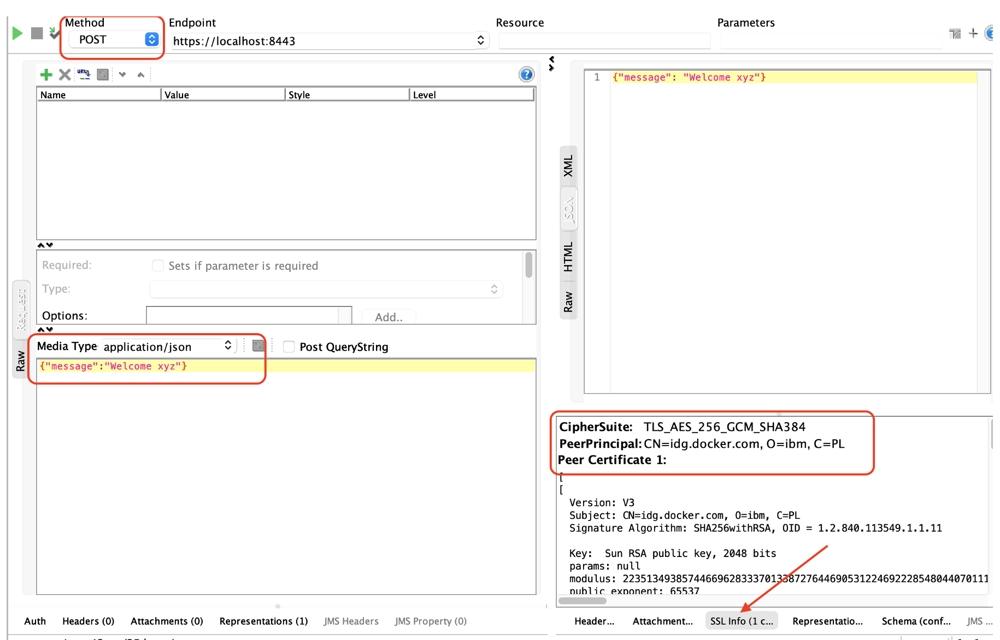

16. Możesz również wykonać test z wykorzystaniem OpenSSL:

```
echo | openssl s_client -showcerts -connect localhost:8080
```