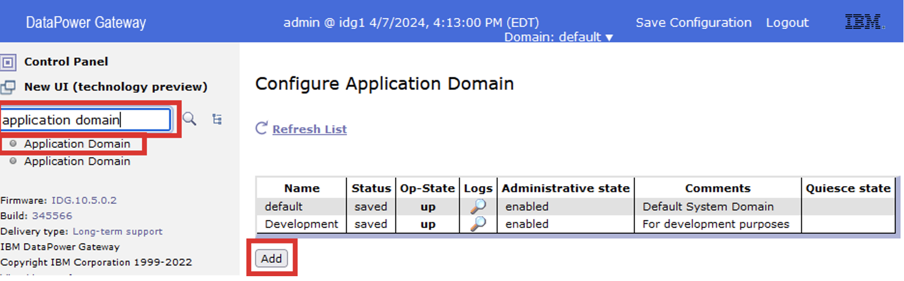
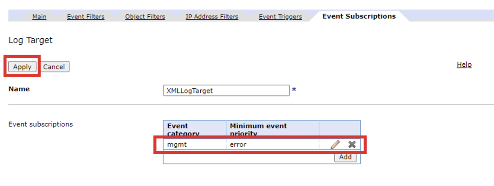
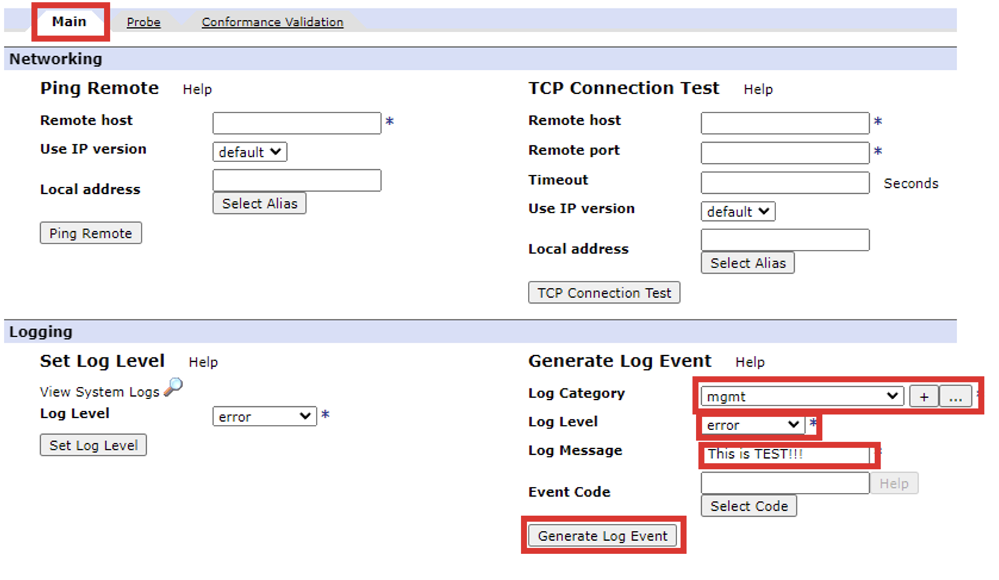

# Narzędzia administracyjne i Troubleshooting IDG

## Procedura wstępna - utworzenie przykładowej konfiguracji

W ramach tego ćwiczenia utworzysz przykładową domenę, w której skonfigurujesz przykładowe usługi, które pozwolą Ci zapoznać się w kolejnych ćwiczeniach z funkcjami monitorowania i rozwiązywania problemów dostępnych w bramie IDG.

1. Na stacji roboczej w przeglądarce wywołaj adresIP DPG wykorzystywany w poprzednich ćwiczeniach: `https://adresIP:9090`i poczekaj na pojawienie się ekranu logowania.


2. Zaloguj się, do domeny `default` korzystając z interfejsu WebGUI używając skonfigurowanego uprzednio hasła:

```
Username: admin
Password: P@ssw0rd!
```
3. W celu utworzenia nowej domeny w wyszukiwarce wpisz: `Application Domain` i wybierz tą opcję, następni kliknij przycisk `Add`.



4. W otwartej zakładce `Application Domain` w polu `Name:` wprowadź nazwę nowej domeny: `adminsitration-debug`. W dolnej części strony zaznacz opcję `Enable Auditing` and `Enable Logging`. Pozostałe opcje pozostaw z domyślnymi ustawieniami, zatwierdź zmiany wybierając przycisk `Apply`, na końcu zapisz wprowadzone zmiany na stałe wybierając `Save Configuration` w prawym górnym rogu.


5. Przejdź do utworzenia przykładowej usługi XML, która posłuży nam do testowania poszczególnych ustawień i mechanizmów monitorowania platformy. W tym celu przechodzimy do nowo utworzonej domeny `administration-debug` wybierając jej nazwę w prawym górnym rogu platformy.


6. W celu utworzenia nowej usługi looback XML w wyszukiwarce wpsiz: `Edit XML Firewall` i wybierz tą opcję, następnie wybierz `Add Advanced`.


7. W oknie `Configure XML Firewall` w polu **Name** wpisz: `LoopBackXMLService`, z listy **Type** wybierz `Loopback`,  w polu **Port Number** wpisz `3223`, z listy **Request Type** wybierz `XML`, z listy **Request attachment processing mode** wybierz `Allow`. Wybierz znak `+` umieszczony obok listy `Procesing Policy`, aby dodać politykę przetwarzania wiadomości.


8. W otwartym oknie `Configure XML Firewall Style Policy` w polu **Policy Name** wpisz `accept`, następnie kliknij przycisk `New Rule` co spowoduje dodanie nowej reguły o nazwie `accept_rule_0`, nie zmieniaj `Rule Destination` na koniec kliknij dwa razy akcję oznaczoną znakiem `=`umieszczoną w środkowej części okna.


9. W otwartym oknie `Configure Matching Action` wybierz przycisk `+` umieszczony obok listy **Matching Rule**.


10. W otwartym oknie `Configure Matching Rule` wpisz `match-all-url` i wybierz przycisk `Add`.


11. W otwartym oknie `Edit Rules` wybierz z listy **Matching type** `URL`, w polu **URL match** wpisz znak `*` i zakończ wybierając przycisk `Apply`.


12. Po powrocie do okna `Configure Matching Rule` wybierz `Apply`.


13. Po powrocie do okna `Configure a Matching Action` upewnij się, że na liście **Matching Rule** figuruje Twoja reguła `match-all-uri` i wybieramy `Done`.


14. Po powrocie do okna `Configure XML Firewall Style Policy` kliknij przycisk `Apply Policy` i zamykamy okno.


15. Po powrocie do okna `Configure XML Firewall` upewnij się, że na liście **Processing Policy** wybrana jest Twoja polityka `accept`, na koniec kliknij `Apply`.


16. Zapisz wprowadzone zmiany wybierając `Save Configuration` w prawym górnym rogu.

## Sprawdzanie właściwości i statusu bramy oraz zdefiniowanych w niej obiektów z poziomu WebGUI

1. Przed przystąpieniem do realizacji tego ćwiczenia wróć do domeny `default` wybierając jej nazwę w prawym górnym rogu ekranu.


2. Brama DPG posiada bardzo wiele widoków pozwalających na sprawdzanie statusów własnej pracy i informacji dotyczących urządzenia, w poniższych ćwiczeniach przetestujesz jedynie te najbardziej istotne. W celu zapoznania się ze wszystkimi dostępnymi opcjami i samodzielnego sprawdzenia wystarczy przejść do menu: `Status`


3. Część informacji zbierana jest w charakterze statystyk, które mogą być domyślnie wyłączone, w celu ich włączenia w polu wyszukiwania wpisz `Statistic Settings`, a następnie wybierz tą opcję.  Następnie zaznacz opcję `Enabled` w polu **Administrative state** i wciśnij przycisk `Apply`.


4. Zapisz wprowadzone zmiany wybierając `Save Configuration` w prawym górnym rogu.
5. W celu wyświetlenia informacji dotyczących wersji IDG i firmware w polu wyszukiwania wpisz `Firmware Information` i wybierz tą opcję.


6. W celu wywoływania informacji o dostępnych funkcjach i modułach w polu wyszukiwania wpisz `Device Features` i wybierz tą opcję. Zapoznaj się z wyświetlonymi informacjami.


7. W celu wywoływania informacji o dostępnych bibliotekach i ich wersjach w polu wyszukiwania wpisz `Librarary Information` i wybierz tą opcję. Zapoznaj się z wyświetlonymi informacjami


8. W celu wywoływania statystyk użycia w polu wyszukiwania wpisz `System Usage` i wybierz tą opcję. Zapoznaj się z wyświetlonymi statystykami.


9. W celu wyświetlenia statystyk wykorzystania procesora w polu wyszukiwania wpisz `CPU Usage` i wybierz tą opcję.  Zapoznaj się z wyświetlonymi statystykami.


10. W celu wyświetlenia statystyk wykorzystania pamięci w polu wyszukiwania wpisz `Memory Usage` i wybierz tą opcję.  Zapoznaj się z wyświetlonymi statystykami


11. W celu wyświetlenia statystyk wykorzystania pamięci per domena w polu wyszukiwania wpisz `Domain Memory Usage` i wybierz tą opcję. Zapoznaj się z wyświetlonymi statystykami


12. W celu wyświetlenia statystyk wykorzystania pamięci przez poszczególne usługi w polu wyszukiwania wpisz `Service Memory Usage` i wybierz tą opcję. W domenie `default`, możesz przełączać się pomiędzy bieżącą domeną a wszystkimi domenami, korzystając z przycisku umieszczonego nad statystykami. Zapoznaj się z wyświetlonymi statystykami.


13. W celu wyświetlenia statystyk dotyczących systemu plików w polu wyszukiwania wpisz `Filesystem Information` i wybierz tą opcję. Zapoznaj się z wyświetlonymi statystykami.


14. W celu wyświetlenia statystyk dotyczących transakcji w polu wyszukiwania wpisz `Transaction Rate` i wybierz tą opcję, następnie wybierz przycisk `Show All Domains`. Zapoznaj się z wyświetlonymi statystykami. Zwróć uwagę, że statystyki muszą być włączone w każdej domenie, aby móc wyświetlić informację.


15. W celu wyświetlenia statystyk dotyczących czasu trwania transakcji w polu wyszukiwania wpisz `Transaction Times` i wybierz tą opcję, następnie wybierz przycisk `Show All Domains`. Zapoznaj się z wyświetlonymi statystykami. Zwróć uwagę, że statystyki muszą być włączone w każdej domenie


16. W celu wyświetlenia informacji statusach portów TCP w polu wyszukiwania wpisz `TCP Port Status` i wybierz tą opcję. Zapoznaj się z wyświetlonymi informacjami


17. W celu wyświetlenia informacji o dostępnych usługach w polu wyszukiwania wpisz `Active Services` i wybierz tą opcję, następnie wybierz przycisk `Show All Domains`. Zapoznaj się z wyświetlonymi informacjami.


18. W celu wyświetlenia informacji o statusie poszczególnych obiektów w polu wyszukiwania wpisz `Object Status` i wybierz tą opcję, następnie wybierz przycisk `Show All Domains`. Postarajnsię odnaleźć na liście informacje dotyczące usługi zdefiniowanej na początku tego ćwiczenia. 


## Konfiguracja logowania (Log Targets i poziomy logowania)

W tym ćwiczeniu zapoznamy się dostępnymi poziomami logowania i możliwościami wysyłania logów do zewnętrznych usług logowania/indeksacji logów

1. W tym celu przejdź do nowo utworzonej domeny `administration-debug` wybierając jej nazwę w prawym górnym rogu platformy.


2. Aby wyświetlić logi systemu DPG dla domeny `administration-debug` w polu wyszukiwania wpisz `System Logs` lub wybierz ikonę `View Logs` w głównej konsoli. 


3. Po  przejściu do podglądu logów zwróć uwagę na poziomy logowania jakie są tam wyświetlone. Domyślnie brama DPG loguje informacje o poziomie **notice** lub większym. Zwróć uwagę, że możesz zawężać informacje według poziomu logowania czy obiektu (w domenie `default` także według domeny) . Korzystając z dostępnych filtrów postaraj się zawęzić informacje do obiektu **mgmt** i poziomu logowania **warning**. Zwróć uwagę, że wybranie poziomu logowania zawęża informacje do poziomu wygranego lub wyższego poziomu logowania – przy zaznaczeniu **warning** powinieneś widzieć też informacje oznaczone jako **error**.


4. W celu zwiększenia poziomu szczegółowości logów w polu wyszukiwania wpisz `Troubleshooting` i wybierz tą opcję. Następnie w sekcji `Logging` wybierz z listy **Log level** `debug`. Zakończ wybierając przycisk `Set Log Level`. Pamiętaj, logowania na poziomie `debug` nie powinno być wybierane w normalnych warunkach pracy systemu, wpływa ono negatywnie na wydajność pracy bramy.


5. Na koniec ćwiczeń nauczysz się wysyłać logi to "zewnętrznego” repozytorium, którym będzie zdefiniowana przez Ciebie uprzednio usługa. W tym celu w polu wyszukiwania wpisz `Log Target` i wybierz tą opcję, następnie wybierz przycisk `Add`.


6. W otwartym oknie `Log Target` w polu **Name** wpisz `XMLLogTarget`, z listy **Target Type** wybierz `SOAP`, z listy **Log Format** wybierz `XML`, w polu **URl** wpisz `http://adresIP:3223`, gdzie adresIP to uprzednio ustalony adres bramy, na koniec przejdź na zakładkę `Event Subscription`.


7. W zakładce `Event Subscription` wybierz przycisk `Add`.


8. W otwartym oknie `Edit Event subscription` wybierzmy z listy **Event Category**: `mgmt`, z listy **Minimum event priority** wybierzmy `error`, a na koniec wybierz `Apply`.


9. Na koniec upewnij się, że Twoja subskrypcja znajduje się na liście w tabeli i następnie wybierz `Apply`.



10. Zdefiniowałeś “zewnętrzne” repozytorium logów. Przetestujesz jego działanie w późniejszych ćwiczeniach.
11. Zapisz wprowadzone zmiany wybierając `Save Configuration` w prawym górnym rogu.

## Raportowanie błędów 

W tym ćwiczeniu nauczysz się mechanizmów zbierania raportów błędów w celu ich zgłoszenia do obsługi wsparcia IBM.

1. Aby przygotować raport błędów dla działu wsparcia firmy IBM w polu wyszukiwania wpisz `Troubleshooting` i wybierz tą opcję, następnie w sekcji **Raporting** wybierz `Generate Error Raport`. Zwróć uwagę, że istnieje możliwość wysłania raportu przy użyciu protokołu SMTP


2. W oknie **Execute Action** wybierz `Confirm`.


3. Po wyświetleniu akcji **Action completed successfully** wybierz `Close`.


4. Następnie skorzystaj z odnośnika `View Error Raport` umieszczone w sekcji **Reporting**.  Zapisz plik z raportem błędu na komputerze.


5. Wyświetl zawartość pobranego pliku z raportem błędu - zwróć uwagę na jego format.

## Narzędzia do przeprowadzania diagnostyki sieci (PING, Connection Test, Przechwytywanie pakietów, Probes)

W tym ćwiczeniu zapoznasz się z dostępnymi narzędziami pozwalającymi na diagnostykę i analizę połączeń sieciowych i działania usług.

1. W celu skorzystania z narzędzia **Ping** w polu wyszukiwania wpisz `Troubleshooting` i wybierz tą opcję, następnie w sekcji **Networking Ping** **Remote Remote Host** wpisz adresIP twojej bramy


2. W otwartym oknie **Execute Action** wybierz `Confitrm`. Na koniec wybierz `Close`.


3. Powtórz test zmieniając ostatni oktet adresu IP na losową liczbę inną niż wpisana dotychczas, aby zaobserwować błąd.
4. Następnie w sekcji **Networking TCP Connection Test Remote Host** wpisz adresIP Twojej bramy, w polu port wpisz `3223`, na koniec wybierz przycisk `TCP Connection Test`.


5. W otwartym oknie **Execute Action** wybierz `Confitrm`. Na koniec wybierz `Close`.


6. Powtórz test zmieniając numer portu np. na `3224`, aby zaobserwować nieudane połączenie.
7. Zdefiniujesz czujkę (ang. Probe) na skonfigurowanym uprzednio serwisie, aby móc obserwować transakcje jakie obsługiwane są przez daną usługę.  W tum celu przejdź na zakładkę **Probe** i odnajdź zdefiniowany uprzednio serwis `LoopBackXMLService` i wybierz umieszczony obok niego przycisk `Add Probe`.


8. W otwartym oknie **Action Completed successfully** wybierz przycisk `Close`.


Zwróć uwagę, że na górze interfejsu pojawi się dodatkowe ostrzeżenie: `Probe is enabled`, which impacts performance. Czujki powinny być deaktywowane po zakończeniu testowania.

9. Teraz przejdź do wygenerowania zrzutu pakietów przy użyciu narzędzi do przechwytywania pakietów. W tym celu musimy przejść do domeny default wybierając jej nazwę w prawym górnym rogu ekranu


10. W celu skorzystania z narzędzia **PCAP** w polu wyszukiwania wpisz `Troubleshooting` i wybierz tą opcję, następnie w sekcji **Packet Capture** wybierz w polu **Interface Type**: `Ethernet Interface`, w polu **Interface Name**: `eth0`, w polu **Mode** wybierz `Continious`, na koniec wybierz `Start Packet Capture`.


11. W otwartym oknie **Execute Action** wybierz `Confirm`.


12. Następnie wybierz `Close`.
13. Wygenerujemsz teraz **Testowe Zdarzenie Logowania**, które powinno być przesłane do naszego serwisu. W tym celu przejdź do domeny `administration-debug`, wybierając jej nazwę w prawym górnym rogu platformy. 
14. W polu wyszukiwania wpisz `Troubleshooting` i wybierz tą opcję, a następnie w sekcji **Logging Generate Log Event** z listy **Log Category** wybierz `mgmt`, z **Log Level** wybierz `Error`, w polu **Log Massage** wpisz `This is TEST!!!`  na koniec wybierz przycisk `Generate Log Event`.



15. W otwartym oknie **Execute Action** wybierz `Confirm`. Po wykonaniu testu wybierz `Close`.


16. Przejdź do zakładki **Probes**, następnie odnajdź swoją czujkę wyświetloną obok serwisu `LoobBackXMLService` i wybierz ikonę **Lupy** aby wyświetlić transakcje.


17. W otwartym oknie powinieneś widzieć połączenia z serwisem. Jeśli w Twoim przypadku lista jest pusta skorzystaj z przycisku **Refresh**. Jeśli nadal nic nie widzisz być może popełniłeś literówkę w konfiguracji serwisu lub źródła logowania. Sprawdź logi w razie wątpliwości poproś o pomoc prowadzącego.
18. Zwróć uwagę, że na liście widać adres URL wchodzący i wychodzący, regułę która przepuściła połączenie i adres klienta. Wybierz ikonę **lupy** umieszczoną obok połączenia, aby uzyskać dostęp do szczegółów danego połączenia.


19. W otwartym oknie danego połączenia zwróć uwagę, że masz dostęp do szeregu szczegółowych informacji takich jak np. **Nagłówki Żądania**.


20. Teraz zatrzymaj czujkę wybierając przycisk `Disable` umieszczony obok naszego serwisu **LooopBackXMLService**. 


21. W otwarym oknie **Action complited successfully!** wybieramy przycisk `Close.`.


22. Zatrzymasz też przechwytywanie pakietów w tym celu musimy przejść do domeny `default` wybierając jej nazwę w prawym górnym rogu ekranu.
23. W celu zatrzymania przechwytywania pakietów polu wyszukiwania wpisz `Troubleshooting` i wybierz tą opcję, następnie w sekcji  **Packet Capture Stop Packet Capture** wybierz w polu **Interface Type**: `Ethernet Interface`, w polu **Interface Name**: `eth0`,  na koniec wybierz `StopPacket Capture`.


24. Plik może zostać pobrany bezpośrednio z linku w sekcji przechowywania lub z sytemu plików DPG. Aby pobrać plik ze zrzutem pakietów z systemu plików w polu wyszukiwania wpisz `File Management` i wybierz tą opcje, następnie w eksploratorze plików wybierz katalog `Temporary` i wskaż plik `capture.pcap.001`. Zapisz plik na lokalnym komputerze.


25. Plik ten można poddać analizie np. w programie WireShark. Program WireShark powinien być dostępny na stacjach. Aby załadować plik wskaż go wykorzystają opcję `Plik -> Otwórz (File -> Open)`. W Filtrze możesz być zmuszony wybrać `All-Files`. Możesz też zmienić rozszerzenie pliku na `*.pcap`. Możesz poeksperymentować z wyszukiwaniem danych korzystając z różnych filtrów, program będzie je podpowiadał np: `tcp.port == 9090` lub `tcp.port == 3223`.

