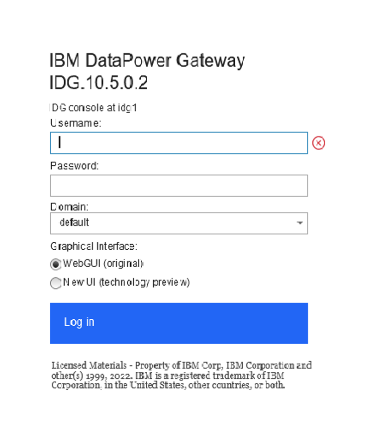
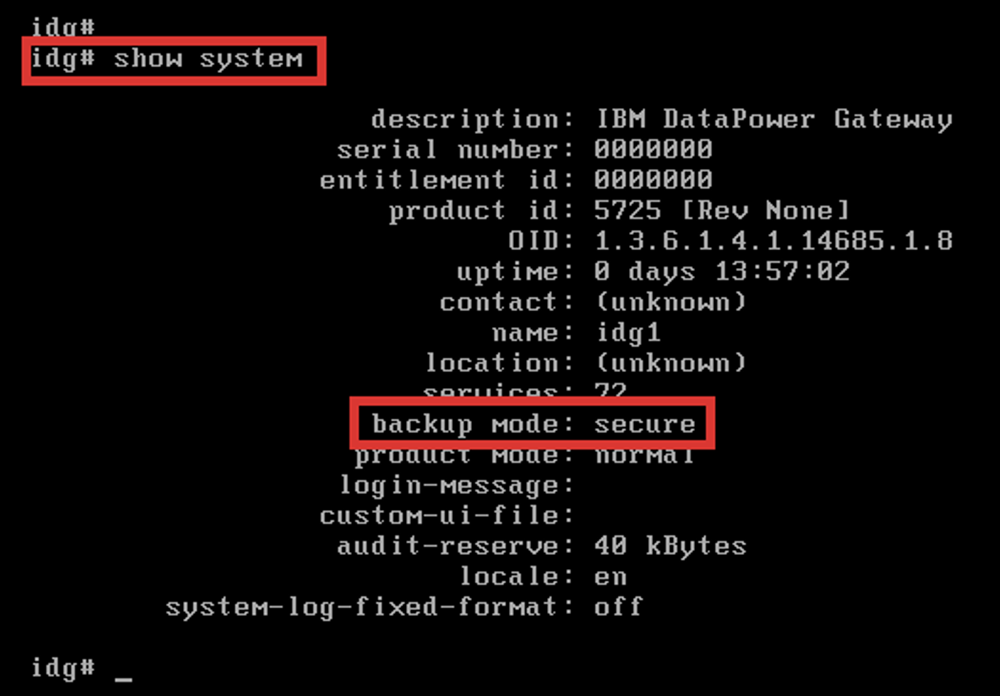

# Tworzenie kopii zapasowych IBM DataPower Gateway

## Sprawdzanie dostępnych trybów wykonywania kopii zapasowych

W ramach tego ćwiczenia sprawdzisz jakie są dostępne tryby wykonywania kopii zapasowych w Twoim IDG wykorzystując interfejs WebGUI i CLI bramki. IDG może być zainicjowana w dwóch trybach wykonywania kopii: **normal** lub **secure**.

1. Na stacji roboczej w przeglądarce wywołaj adresIP DPG wykorzystywany w poprzednich ćwiczeniach: `https://adresIP:9090`i poczekaj na pojawienie się ekranu logowania.



2. Zaloguj się, do domeny `default` korzystając z interfejsu WebGUI używając skonfigurowanego uprzednio hasła:

```
Username: admin
Password: P@ssw0rd!
```

3. W celu sprawdzenia dostępnych trybów wykonywania kopii bezpieczeństwa w wyszukiwarce wpisz: `system settings` i wybierz tą opcję.


4. Upewnij się, że w polu `Backup mode` widoczny jest **Secure Backup**.
5. Na koniec wyloguj się z interfejsu WWW DPG wybierając `Logout`.
6. Zaloguj się do interfejsu CLI wywołując konsolę maszyny wirtualnej IDG.
7. Po zalogowaniu wpisz komendę `show system`.



8. W wyświetlonych danych wyszukaj wpisu `backup mode: secure`.

Tryb bezpiecznego backupu możliwy jest do ustawienia podczas inicjalizacji DPG. Jesli tryb ten nie byłby dostępny, wymagana byłaby reinicjalizacja użądządzenia, co doprowdziłoby do utraty danych.

## Procedura wstępna - utworzenie przykładowej konfiguracji

W ramach tego ćwiczenia utworzysz przykładową domenę w której skonfigurujesz konta użytkowników oraz dodasz definicję certyfikatów.

1. Na stacji roboczej w przeglądarce wywołaj adresIP DPG wykorzystywany w poprzednich ćwiczeniach: `https://adresIP:9090`i poczekaj na pojawienie się ekranu logowania.
2. Zaloguj się, do domeny `default` korzystając z interfejsu WebGUI używając skonfigurowanego uprzednio hasła:

```
Username: admin
Password: P@ssw0rd!
```

3. Rozpoczniesz od utworzenia nowej domeny. W celu utworzenia nowej domeny w wyszukiwarce wpisz: `Application Domain` i wybierz tą opcję, następni kliknij przycisk `Add`.


4. W otwartej zakładce `Application Domain` w polu `Name:` wprowadź nazwę nowej domeny: `backup-test`. Pozostałe opcje pozostaw z domyślnymi ustawieniami, zatwierdź zmiany wybierając przycisk `Apply`, na końcu zapisz wprowadzone zmiany na stałe wybierając `Save Configuration` w prawym górnym rogu.


5. W celu utworzenia nowego użytkwownika przypisanego do domeny w wyszukiwarce wpisz: `New User Account` i wybierz tą opcję, następni wybierz przycisk `Yes` w odpowiedzi na pytanie: `Should the user be restricted to a domain? (deprecated)`, aby ograniczyć użytkownika do wybranej domeny.


6. 