# Tworzenie kopii zapasowych IBM DataPower Gateway

## Sprawdzanie dostępnych trybów wykonywania kopii zapasowych

W ramach tego ćwiczenia sprawdzisz jakie są dostępne tryby wykonywania kopii zapasowych w Twoim IDG wykorzystując interfejs WebGUI i CLI bramki. IDG może być zainicjowana w dwóch trybach wykonywania kopii: **normal** lub **secure**.

1. Na stacji roboczej w przeglądarce wywołaj adresIP DPG wykorzystywany w poprzednich ćwiczeniach: `https://adresIP:9090`i poczekaj na pojawienie się ekranu logowania.


2. Zaloguj się, do domeny `default` korzystając z interfejsu WebGUI używając skonfigurowanego uprzednio hasła:

```
Username: admin
Password: P@ssw0rd!
```

3. W celu sprawdzenia dostępnych trybów wykonywania kopii bezpieczeństwa w wyszukiwarce wpisz: `system settings` i wybierz tą opcję.


4. Upewnij się, że w polu `Backup mode` widoczny jest **Secure Backup**.
5. Na koniec wyloguj się z interfejsu WWW DPG wybierając `Logout`.
6. Zaloguj się do interfejsu CLI wywołując konsolę maszyny wirtualnej IDG.
7. Po zalogowaniu wpisz komendę `show system`.


8. W wyświetlonych danych wyszukaj wpisu `backup mode: secure`.

Tryb bezpiecznego backupu możliwy jest do ustawienia podczas inicjalizacji DPG. Jesli tryb ten nie byłby dostępny, wymagana byłaby reinicjalizacja użądządzenia, co doprowdziłoby do utraty danych.

## Procedura wstępna - utworzenie przykładowej konfiguracji

W ramach tego ćwiczenia utworzysz przykładową domenę w której skonfigurujesz konta użytkowników oraz dodasz definicję certyfikatów.

1. Na stacji roboczej w przeglądarce wywołaj adresIP DPG wykorzystywany w poprzednich ćwiczeniach: `https://adresIP:9090`i poczekaj na pojawienie się ekranu logowania.
2. Zaloguj się, do domeny `default` korzystając z interfejsu WebGUI używając skonfigurowanego uprzednio hasła:

```
Username: admin
Password: P@ssw0rd!
```

3. Rozpoczniesz od utworzenia nowej domeny. W celu utworzenia nowej domeny w wyszukiwarce wpisz: `Application Domain` i wybierz tą opcję, następni kliknij przycisk `Add`.


4. W otwartej zakładce `Application Domain` w polu `Name:` wprowadź nazwę nowej domeny: `backup-test`. Pozostałe opcje pozostaw z domyślnymi ustawieniami, zatwierdź zmiany wybierając przycisk `Apply`, na końcu zapisz wprowadzone zmiany na stałe wybierając `Save Configuration` w prawym górnym rogu.

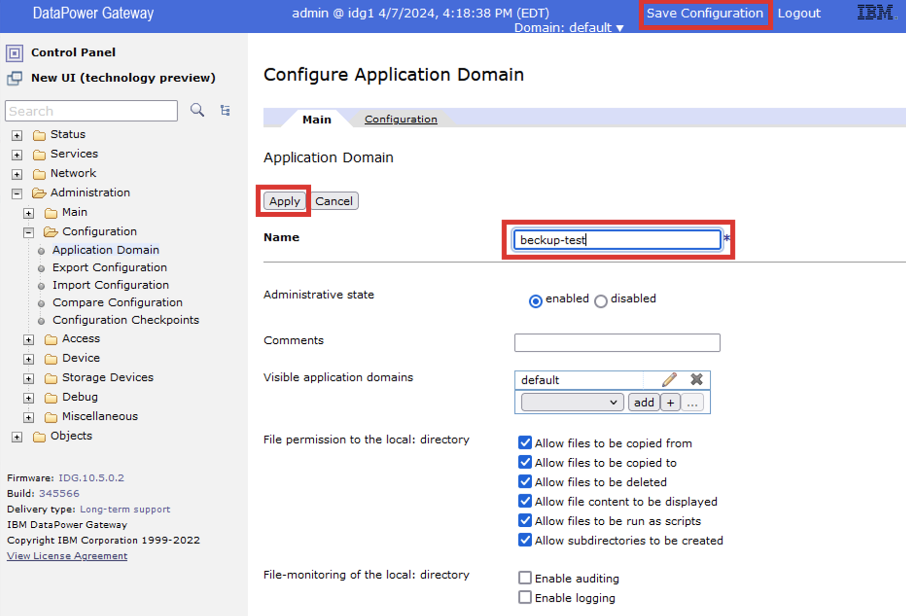

5. W celu utworzenia nowego użytkwownika przypisanego do domeny w wyszukiwarce wpisz: `New User Account` i wybierz tą opcję, następni wybierz przycisk `Yes` w odpowiedzi na pytanie: `Should the user be restricted to a domain? (deprecated)`, aby ograniczyć użytkownika do wybranej domeny.

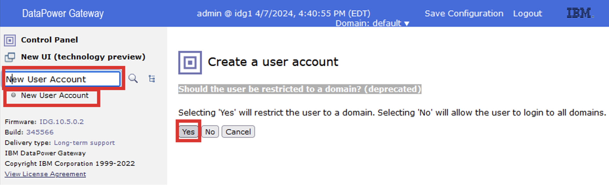

6. W oknie `To which domain should the user be restricted? (deprecated)` wybierz nowo utworzoną domenę `backup-test` z listy dostępnych domen i wybierz przycisk `Next`.


7. W kolejnym oknie pozostaw ustawienia domyślne i wybierz przycisk `Next`.


8. Na następnym oknie wpisz w polu `Name` nazwę użytkownika: `test-backup`, w polach `Password` dwukrotnie wpisz hasło: `P@ssw0rd!`, po uzupełnieniu pól wybierz przycisk `Next`.


9. W kolejnym oknie wybierz przycisk `Commit`.


10. W ostanim oknie `Should the user be restricted to a domain? (deprecated)` wybierz przycisk `Yes`.


11. Zapisz wprowadzone zmiany wybierając `Save Configuration` w prawym górnym rogu.
12. Przejdź do nowo utworzonej domeny `backup-test` wybierając jej nazwę z listy dostępnych domen.


13. W celu utworzenia nowego przykładowego certyfikatu SSL w ramach danej domeny w wyszukiwarce wpisz: `Crypto Key` i wybierz tą opcję, w otwarty oknie `Configure Crypto Certificate` wybierz przycisk `Add`.

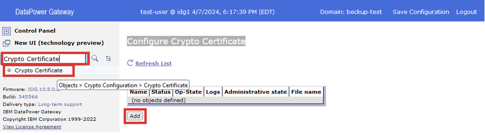

14. W polu `Name` wprowadź nazwę certyfikatu: `example.com.crt`, następnie wybierz przycisk `Upload`.


15. W otwartym oknie wgrywania plików wykorzystując przycisk `Browse` wskaż plik certyfikatu `C:\DataPowerAdminTraining\Lab5\example.com.crt` i wybierz przycisk `Upload`.

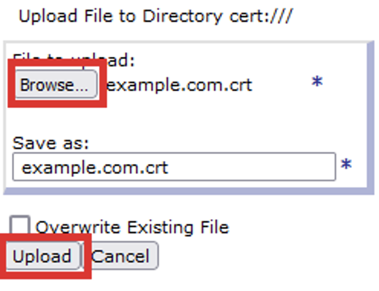

16. Następnie kliknij `Continue`.


17. Po powrocie do okna `Crypto Certificate` wybierz przycisk `Apply`. W celu utworzenia nowego przykładowego klucza SSL w ramach danej domeny w wyszukiwarce wpisz: `Crypto Key` i wybierz tą opcję, w otwarty oknie `Configure Crypto Key` wybierz przycisk `Add`.


18. W polu `Name` wprowadź nazwę certyfikatu: `example.com.key`, następnie wybierz przycisk `Upload`.

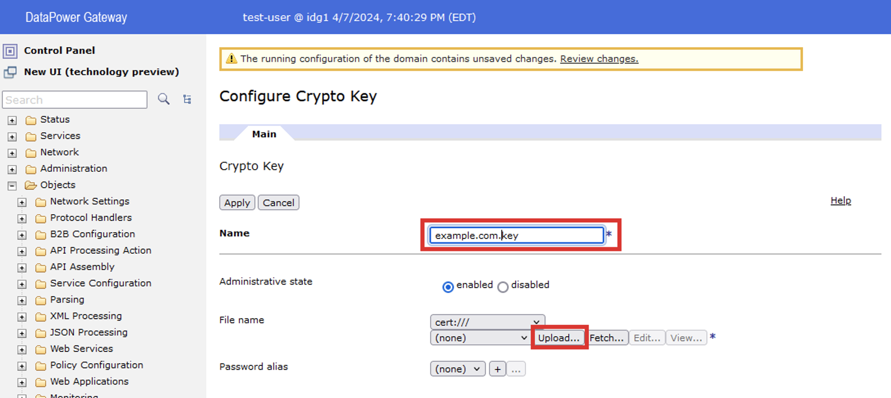

19. W otwartym oknie wgrywania plików wykorzystując przycisk `Browse` wskaż plik certyfikatu `C:\DataPowerAdminTraining\Lab5\example.com.key` i wybierz przycisk `Upload`.

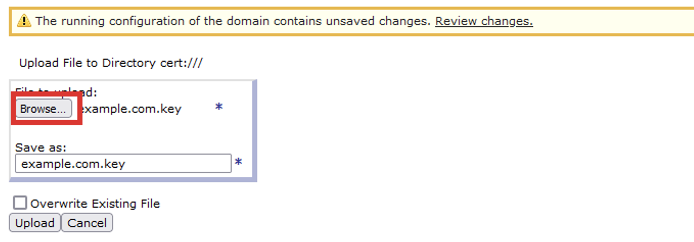

20. Następnie kliknij `Continue`.

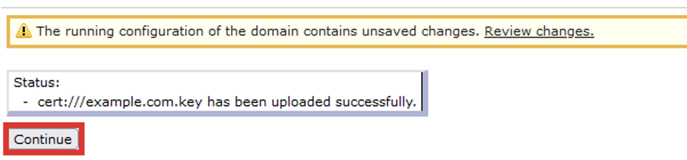

21. Po powrocie do okna `Crypto Certificate` wybierz przycisk `Apply`.


22. Zapisz wprowadzone zmiany wybierając `Save Configuration` w prawym górnym rogu.

## Uwagi ogólne dotyczące wykonywania kopii

-	Importowanie danych z wyższej wersji głównej oprogramowania do niższej nie jest wspierane
-	Zmiana wyeksportowanych plików konfiguracyjnych nie jest objęta wsparciem
-	Należy upewnić się, że wykonując kopie bezpieczeństwa jesteśmy zalogowani na użytkownika posiadającego odpowiednie uprawnienia. Jeśli wykonujemy kopie jako inny użytkownik niż główny administrator, może się okazać, że jedynie podzbiór ustawień konfiguracyjnych jest dla niego dostępny
-	Należy ustalić czy wykonanie kopii plików znajdujących się na RAID urządzenia jest konieczne - tworzenie kopii zapasowej macierzy RAID będzie wymagało więcej miejsca i przetwarzania na urządzeniu
-	Na środowiskach nieprodukcyjnych zaleca się odizolowanie urządzenia od normalnego ruchu (w trakcie wykonania kopii czy eksportu konfiguracji usługi urządzenia nie powinny być wywoływane).
-	Należy się upewnić, że w danym momencie czasu inny użytkownik nie zmienia konfiguracji urządzenia. 
-	Zalecane jest usunięcie zbędnych plików z położeń: local, store, logstore. Pliki te niepotrzebne zwiększyć rozmiar kopii


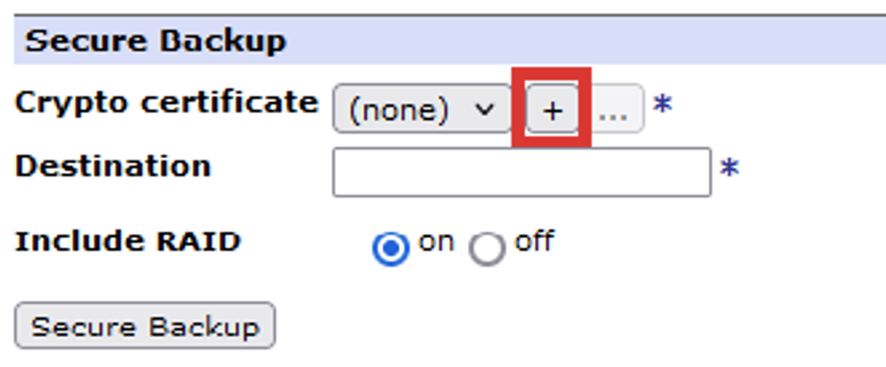


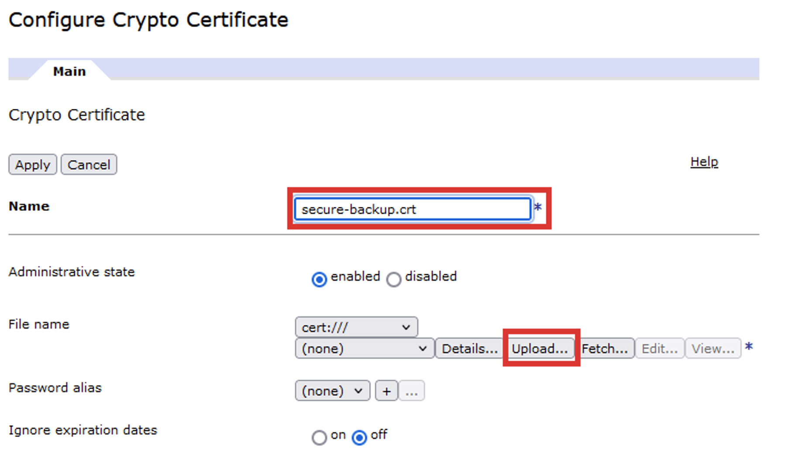


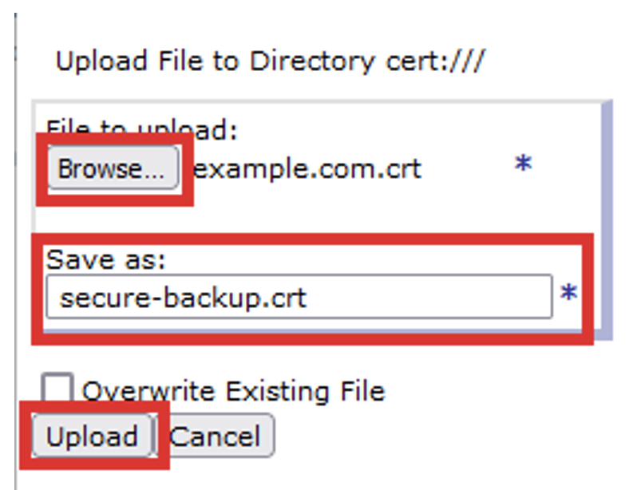


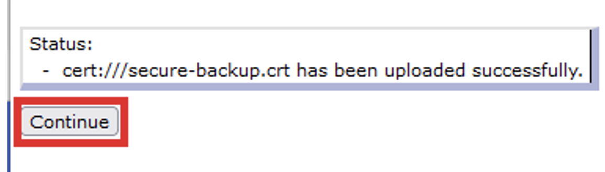


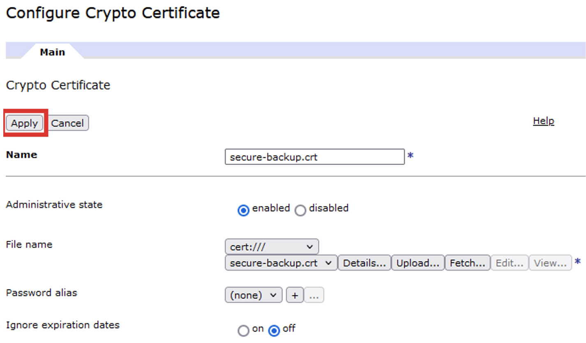


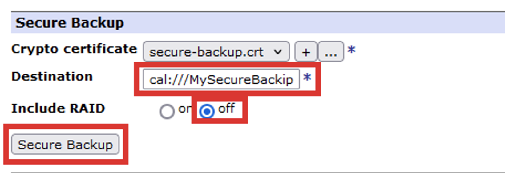