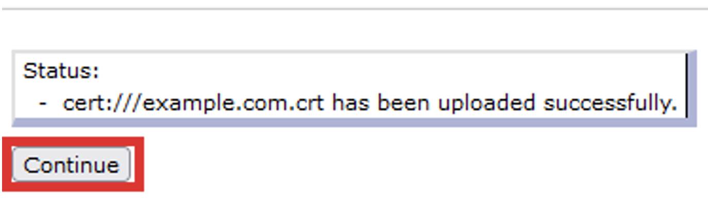
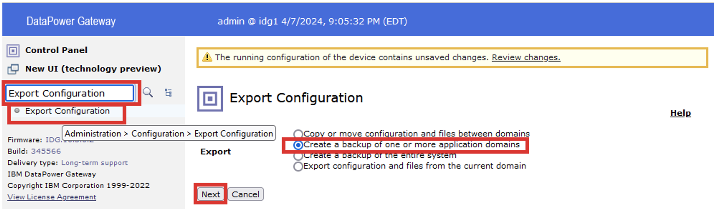

# Tworzenie kopii zapasowych IBM DataPower Gateway

## Sprawdzanie dostępnych trybów wykonywania kopii zapasowych

W ramach tego ćwiczenia sprawdzisz jakie są dostępne tryby wykonywania kopii zapasowych w Twoim IDG wykorzystując interfejs WebGUI i CLI bramki. IDG może być zainicjalizowany w dwóch trybach wykonywania kopii: **normal** lub **secure**.

1. Na stacji roboczej w przeglądarce wywołaj adresIP DPG wykorzystywany w poprzednich ćwiczeniach: `https://adresIP:9090`i poczekaj na pojawienie się ekranu logowania.


2. Zaloguj się, do domeny `default` korzystając z interfejsu WebGUI używając skonfigurowanego uprzednio hasła:

```
Username: admin
Password: P@ssw0rd!
```

3. W celu sprawdzenia dostępnych trybów wykonywania kopii bezpieczeństwa w wyszukiwarce wpisz: `system settings` i wybierz tą opcję.


4. Upewnij się, że w polu `Backup mode` widoczny jest **Secure Backup**.
5. Na koniec wyloguj się z interfejsu WWW DPG wybierając `Logout`.
6. Zaloguj się do interfejsu CLI wywołując konsolę maszyny wirtualnej IDG.
7. Po zalogowaniu wpisz komendę `show system`.


8. W wyświetlonych danych wyszukaj wpisu `backup mode: secure`.

Tryb bezpiecznego backupu możliwy jest do ustawienia podczas inicjalizacji DPG. Jesli tryb ten nie byłby dostępny, wymagana byłaby reinicjalizacja urządządzenia, co doprowdziłoby do utraty danych.

## Procedura wstępna - utworzenie przykładowej konfiguracji

W ramach tego ćwiczenia utworzysz przykładową domenę w której skonfigurujesz konta użytkowników oraz dodasz definicję certyfikatów.

1. Na stacji roboczej w przeglądarce wywołaj adresIP DPG wykorzystywany w poprzednich ćwiczeniach: `https://adresIP:9090`i poczekaj na pojawienie się ekranu logowania.
2. Zaloguj się, do domeny `default` korzystając z interfejsu WebGUI używając skonfigurowanego uprzednio hasła:

```
Username: admin
Password: P@ssw0rd!
```

3. Rozpoczniesz od utworzenia nowej domeny. W celu utworzenia nowej domeny w wyszukiwarce wpisz: `Application Domain` i wybierz tą opcję, następni kliknij przycisk `Add`.


4. W otwartej zakładce `Application Domain` w polu `Name:` wprowadź nazwę nowej domeny: `backup-test`. Pozostałe opcje pozostaw z domyślnymi ustawieniami, zatwierdź zmiany wybierając przycisk `Apply`, na końcu zapisz wprowadzone zmiany na stałe wybierając `Save Configuration` w prawym górnym rogu.


5. W celu utworzenia nowego użytkwownika przypisanego do domeny w wyszukiwarce wpisz: `New User Account` i wybierz tą opcję, następni wybierz przycisk `Yes` w odpowiedzi na pytanie: `Should the user be restricted to a domain? (deprecated)`, aby ograniczyć użytkownika do wybranej domeny.


6. W oknie `To which domain should the user be restricted? (deprecated)` wybierz nowo utworzoną domenę `backup-test` z listy dostępnych domen i wybierz przycisk `Next`.


7. W kolejnym oknie pozostaw ustawienia domyślne i wybierz przycisk `Next`.


8. Na następnym oknie wpisz w polu `Name` nazwę użytkownika: `test-backup`, w polach `Password` dwukrotnie wpisz hasło: `P@ssw0rd!`, po uzupełnieniu pól wybierz przycisk `Next`.


9. W kolejnym oknie wybierz przycisk `Commit`.


10. Zapisz wprowadzone zmiany wybierając `Save Configuration` w prawym górnym rogu.
11. Przejdź do nowo utworzonej domeny `backup-test` wybierając jej nazwę z listy dostępnych domen.


12. W celu utworzenia nowego przykładowego certyfikatu SSL w ramach danej domeny w wyszukiwarce wpisz: `Crypto Key` i wybierz tą opcję, w otwarty oknie `Configure Crypto Certificate` wybierz przycisk `Add`.


13. W polu `Name` wprowadź nazwę certyfikatu: `example.com.crt`, następnie wybierz przycisk `Upload`.


14. W otwartym oknie wgrywania plików wykorzystując przycisk `Browse` wskaż plik certyfikatu `C:\DataPowerAdminTraining\Lab5\example.com.crt` i wybierz przycisk `Upload`.


15. Następnie kliknij `Continue`.



16. Po powrocie do okna `Crypto Certificate` wybierz przycisk `Apply`. W celu utworzenia nowego przykładowego klucza SSL w ramach danej domeny w wyszukiwarce wpisz: `Crypto Key` i wybierz tą opcję, w otwarty oknie `Configure Crypto Key` wybierz przycisk `Add`.


17. W polu `Name` wprowadź nazwę certyfikatu: `example.com.key`, następnie wybierz przycisk `Upload`.


18. W otwartym oknie wgrywania plików wykorzystując przycisk `Browse` wskaż plik certyfikatu `C:\DataPowerAdminTraining\Lab5\example.com.key` i wybierz przycisk `Upload`.


19. Następnie kliknij `Continue`.


20. Po powrocie do okna `Crypto Certificate` wybierz przycisk `Apply`.


21. Zapisz wprowadzone zmiany wybierając `Save Configuration` w prawym górnym rogu.

## Uwagi ogólne dotyczące wykonywania kopii

-	Importowanie danych z wyższej wersji głównej oprogramowania do niższej nie jest wspierane.
-	Zmiana wyeksportowanych plików konfiguracyjnych nie jest objęta wsparciem.
-	Należy upewnić się, że wykonując kopie bezpieczeństwa jesteśmy zalogowani na użytkownika posiadającego odpowiednie uprawnienia. Jeśli wykonujemy kopie jako inny użytkownik niż główny administrator, może się okazać, że jedynie podzbiór ustawień konfiguracyjnych jest dla niego dostępny.
-	Należy ustalić, czy wykonanie kopii plików znajdujących się na RAID urządzenia jest konieczne - tworzenie kopii zapasowej macierzy RAID będzie wymagało więcej miejsca i przetwarzania na urządzeniu
-	Na środowiskach nieprodukcyjnych zaleca się odizolowanie urządzenia od normalnego ruchu (w trakcie wykonania kopii czy eksportu konfiguracji usługi urządzenia nie powinny być wywoływane).
-	Należy się upewnić, że w danym momencie czasu inny użytkownik nie zmienia konfiguracji urządzenia. 
-	Zalecane jest usunięcie zbędnych plików z położeń: `local`, `store`, `logstore`. Pliki te niepotrzebne mogą zwiększyć rozmiar kopii.

## Utworzenie pełnej kopii urządzenia: Secure Backup

Pamiętaj, że wykonanie bezpiecznej kopii wymaga podania certyfikatu, który kopie będzie zabezpieczał.

1. W celu utworzenia bezpiecznej kopii przejdź do domyślnej domeny default wybierając jej nazwę z listy dostępnych domen.


2. Następnie w  w wyszukiwarce wpisz: `System Control` i wybierz tą opcję.


3. Bezpieczne kopie wymagają do utworzenia certyfikatów. Rozpoczniesz od jego utworzenia wybierając w sekcji `Secure Backup` przycisk oznaczony znakiem `+`.


4. W otwartym oknie `Configure Crypto Certificate` wpisz w polu Name nazwę: `secure-backup.crt` i wybieramy przycisk `Upload`.


5. W otwartym oknie `Upload File to Directory cert:///` wskaż plik certyfikatu `C:\DataPowerAdminTraining\Lab5\example.com.crt`, w polu `Save As:` wpisz `secure-backup.crt` na koniec wybierz przycisk `Upload`.


6. Następnie kliknij `Continue`.


7. Po powrocie do okna `Configure Crypto Certificate` wybierz przycisk `Apply`.


8. W sekcji **Secure Beckup** upewnij się, że w polu `Crypto certificate` pojawił się wpis `secure-backup.crt`,  w polu `Destination` wpisz: `local:///MySecureBackup`, w polu `Include RAID` wybierz `off`, na koniec wybierz przycisk `Secure Backup`.


9. W otwartym oknie **Execure Action** wybierz `Confirm` i poczekaj na zakończenie operacji.


10. Na koniec po wyświetleniu informacji **Action completed successfully** zamknij okno wybierając `Close`.


11. Zapisz wprowadzone zmiany wybierając `Save Configuration` w prawym górnym rogu.
12. Następnie w wyszukiwarce wpisz: `File Management` i wybierz tą opcję. W przeglądarce plików po prawej stronie rozwiń `Local -> MySecureBackup` i upewniamy się, że znajdują się tam pliki bezpiecznej kopii.


13. Pliki kopii mogą zostać zgrane przy wykorzystaniu menu `Actions`.

Należy pamiętać, aby przy wykonaniu bezpiecznej kopii zawsze zabezpieczyć certyfikat i odpowiadający mu klucz, kóre posłużyły do wykonania bazpiecznej kopii.

## Utworzenie kopii wybranej konfiguracji IDG

1. W celu wykonania kopii wybranych danych DPG w wyszukiwarce wpisz: `Export Configuration` i wybieramy tą opcję. 
2. Następnie zaznacz opcję `Create a backup of one or more application domains` i kliknij `Next`.



3. Na kolejnym ekranie w polu `Export file` name wpisz `domains-export`, zaznaczamy domenę `backup-test` i `defualt` jako domeny do wyeksportowania i wybieramy przycisk `Next`.


4. No koniec pobierz plik korzystając z przycisku `Download` i zapisz plik kopi.


5. Po wszystkim kliknij `Done`.

## Usunięcie danych z IDG

W tym ćwiczeniu usuniesz domenę, użytkownika oraz certyfikaty.

1. W celu skasowania domeny w wyszukiwarce wpisz: `Application Domain` i wybierz tą opcję, następnie wybierz domenę `backup-test` z wyświetlonej listy domen.


2. Po wyświetleniu szczegółów domeny `backup-test`, skasuj ją korzystając z przycisku `Delete`.


3. Potwierdź kasowanie wybierając przycisk `OK`.
4. W celu skasowania uprzednio utworzonego użytkownika w wyszukiwarce wpisz: `User Account` i  wybierz tą opcję, następnie wybierz nazwę użytkownika `test-user`.


5. Po wyświetleniu szczegółów użytkownika wybierz przycisk `Delete`.


6. Potwierdź usunięcie użytkownika wciskając przycisk `OK`.
7. Zapisz wprowadzone zmiany wybierając `Save Configuration` w prawym górnym rogu.

## Przywrócenie kopii wybranej konfiguracji IDG

1. W celu przywrócenia kopii konfiguracji systemu w wyszukiwarce wpisz: `Iport Confmiguration` i wybierz tą opcję, następnie wybierz `Browse` i wskarz plik: `domain-export.zip`, który zapisałeś tworząc kopie. Po wgraniu pliku wybierz `Next`.


2. W kolejnym oknie w ramce `Domains contained in this Package:`  odznacz listę domen do zaimportowania `default` i `backup-test`, następnie wybierz `Restore`. (Wybranie `Next` pozwala dostosować przywracane dane z kopii – my chcemy przywrócić wszystko).


3. Zostanie wyświetlona informacja dotycząca przywracania danych. Zwróć uwagę na wyświetlone informacje po czym wybierz przycisk `Done`.


Postaraj się ustalić jaki jest status przywrócenia następujących elementów systemu:
-	Domeny `backup-test`, czy widać ją ponownie na liście domen?
-	Konta użytkownika `test-user` w tym celu w domenie default w polu wyszukiwania wpisz `User Account` i wybierz tę opcję - sprawdź czy przywrócił się użytkownik `test-user`
-	Certyfikatów w tym celu w domenie `backup-test` w polu wyszukiwania wpisz `Crypto Certificate` i wybierz tę opcję - jaki jest status certikatów i z czego on wynika?
-	Kluczy tym celu w domenie backup-test w polu wyszukiwania wpisz `Crypto Key` i wybierz tę opcję - jaki jest status kluczy i z czego on wynika?
-	Plików certyfikatów i kluczy w tym celu w polu wyszukiwania wpisz `File Management`, a następnie wybierz tą opcję i sprawdź w wyszukiwarce plików zawartość katalogu `cert`.

## Przywrócenie pełnej kopii urządzenia: Secure Backup

1. W celu przywrócenia bezpiecznej kopii przejdź do domyślnej domeny `default` wybierając jej nazwę z listy dosępnych domen.


2. Następnie w wyszukiwarce wpisz: `System Control` i wybierz tą opcję.


3. W sekcji Secure Restore skorzystaj z przycisku oznaczonego znakiem `+` umieszczonego w polu `Crypto Credentuials`, aby utworzyć poświadczenie kryptograficzne do przywrócenia kopii.


4. W otwartym oknie `Configure Crypto Identification Credentials` w polu `Name`: wpisz `restore-credentials`, z listy `Certificate` wybierz utworzony w czasie tworzenia kopii certyfikat `secure-backup.crt`, na koniec wybierz przycisk `+` umieszczony obok `Crypto Key`, aby utworzyć definicję klucza.


5. W otwartym oknie `Configure Crypto Key` wpisz nazwę certyfikatu `secure-backup.key` i skorzystaj z przycisku `Upload`, aby załadować plik klucza.


6. W otwartym oknie `Upload File to Directory cert:///` wskaż plik certyfikatu `C:\DataPowerAdminTraining\Lab5\example.com.key`, w polu `Save As`: wpisz `secure-backup.key` na koniec wybierz przycisk `Upload`.


7. Następnie kliknij `Continue`.


8. W oknie `Configure Crypto Key` po upewnieniu się, że pojawiła się plik klucza wybierz przycisk `Apply`.


9. W oknie `Configure Crypto Identification Credentials` po upewnieniu się, że wpisano nazwę klucza i certyfikatu wybierz `Apply`


10. W sekcji `Secure Restore` po upewnieniu się, że uzupełnione są dane `Crypto Credentials`, w polu `Source` wprowadź lokalizację, w której zapisałeś Bezpieczną Kopię: `local:///MySecureBackup` na koniec wybierz przycisk `Secure Restore`.


11. W oknie `Exucte Action` wybierz `Confirm`.


12. Nastąpi przywrócenie Bezpiecznej Kopii. W trakcie przywracania nastąpi restart urządzenia DPG. 
13. Po uruchomieniu na stacji roboczej w przeglądarce wywołaj adresIP DPG wykorzystywany w poprzednich ćwiczeniach: `https://adresIP:9090`. Poczekaj na pojawienie się ekranu logowania i zaloguj się do systemu.


14. Po zalogowniu postaraj się ustalić jaki jest status przywrócenia następujących elementów systemu:

-	Domeny `backup-test`, czy widać ją ponownie na liście domen?
-	Konta użytkownika `test-user` w tym celu w domenie `default` w polu wyszukiwania wpisz `User Account` i wybierz tę opcję - sprawdź czy przywrócił się użytkownik `test-user`
-	Certyfikatów w tym celu w domenie `backup-test` w polu wyszukiwania wpisz `Crypto Certificate` i wybierz tę opcję - jaki jest status certyfikatów?
-	Kluczy tym celu w domenie `backup-test` w polu wyszukiwania wpisz `Crypto Key` i wybierz tę opcję - jaki jest status kluczy?
-	Plików certyfikatów i kluczy w tym celu w polu wyszukiwania wpisz `File Management` a następnie wybierz tą opcję i sprawdź w wyszukiwarce plików zawartość katalogu `cert`
