# Usługa WS-Proxy IDG

## Podstawowe usługi DataPower

Aby możliwe było korzystanie z funkcji DataPower, potrzebujemy skonfigurować usługi w ramach IDG. IBM DataPower Gateway pozwala na konfigurację wielu usług, które spełniają różne funkcjonalności w zależności od potrzeb.

Dzielimy je na różne typy. Wybrany typ zależy od:
- Potrzeby przetwarzania.
- Wykorzystywanych protokołów komunikacyjny.
- Typów serwerów aplikacji końcowych/wewnętrznych (back-end).

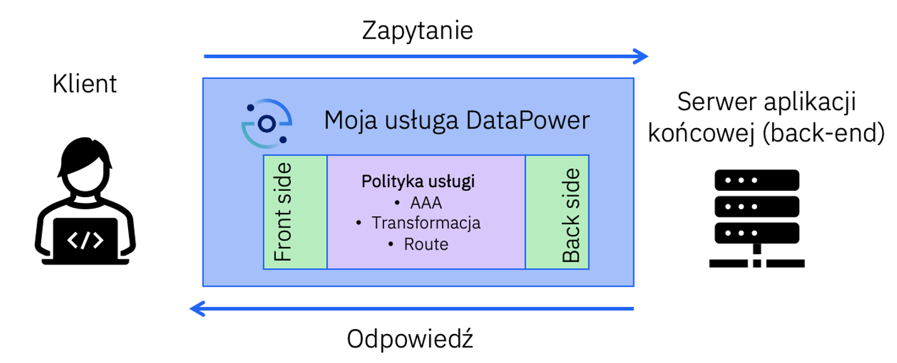

"Front side” definiuje interfejs klienta do usługi DataPower.Większość usług ma politykę przetwarzania, którą konfigurujesz tak, aby zapewniała funkcje DataPower potrzebne danej usłudze. „Back side” definiuje interfejs usługi wychodzącej DataPower do serwerów aplikacji końcowym (back-end).

Podstawowe usługi dostępne w ramach DataPower Gateway to:

<table>
  <thead>
    <tr>
      <th> XML Firewall — zabezpiecza i odciąża przetwarzanie XML z wewnętrznych aplikacji (back-end) opartych na XML. Obsługuje między innymi Filtrowanie ruchu, walidacja i weryfikacja danych, kontrola dostępu, wirtualizacja usługi, kryptografia na poziomie wiadomości i pola.</th>
      <th rowspan="4"> 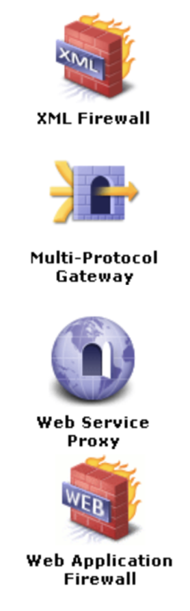 </th>
    </tr>
    <tr>
      <th> Multi-Protocol Gateway (MPGW) — odbiera komunikaty od klientów korzystających z różnych protokołów komunikacyjnych i wysyła komunikaty do usług back-end’owych za pośrednictwem różnych protokołów. Dodatkowo obsługuje funkcje podobne do XML Firewall. </th>
    </tr>
    <tr>
      <th> Web Service Proxy (WS-Proxy) — wirtualizuje i zabezpiecza aplikacje back-end’owe usług internetowych. Dodatkowo obsługuje funkcje podobne do XML Firewall.</th>
    </tr>
    <tr>
      <th> Web Application Firewall (WAFW) — zabezpiecza i odciąża przetwarzanie aplikacji internetowych. Obsługuje między innymi mediację zagrożeń, AAA i weryfikacje internetowa.</th>
    </tr>
  </thead>
</table>

## Dostęp do plików i katalogów na laptopie

Wszystkie pliki wymagane do wykonania tego ćwiczenia znajdują się w następującym folderze lokalnym:

`C:\DataPowerAdminTraining\Lab6`

## Usługa Web Service Proxy

Celem tego ćwiczenia jest poznanie usługi WS-Proxy oraz podstawowa konfiguracja następujących funkcji:
- SLM Policy
- AAA Policy
- Ochrona przed atakiem SQL Injection

### Podstawowa konfiguracja usługi WS-Proxy

Aby skonfigurować WS-Proxy będzie Ci potrzebny dokument WSDL, który opisuje usługę internetowa z wykorzystaniem XML.

> [!NOTE]
> Dokument WSDL to opis usługi internetowej, definiujący metody, parametry, formaty danych i protokoły komunikacyjne. Umożliwia klientom interakcję z usługą bez znajomości jej wewnętrznej implementacji, dzięki czemu usprawnia tworzenie rozproszonych systemów opartych na usługach (SOA).

1. Dokument WSDL potrzebny do zajęć znajdziecie w folderze `C:\DataPowerAdminTraining\Lab6\dataflex.wsdl`
2. W ramach ćwiczeń skorzystasz z ogólnodostępnej usługi internetowej [**DataFlex**](http://webservices.oorsprong.org/websamples.countryinfo/CountryInfoService.wso), która zwracania informacji dt. różnych krajów.
3. Przed rozpoczęciem ćwiczeń zmień domenę na `dev`. Jeśli nie masz domeny `dev`, stwórz nową domenę o nazwie `Developer`.
4. Wybierz ikonę **WS-Proxy** na panelu głównym WebGUI DataPower, a następnie kliknij `Add`, aby dodać nową usługę.
5. Wprowadź nazwę usługi: `DataFlex`
6. W kolejnym kroku załaduj dokument WSDL (`dataflex.wsdl`) dostępny w folderze zajęć, a następnie kliknij `Next`. Pozostaw resztę ustawień bez zmian.

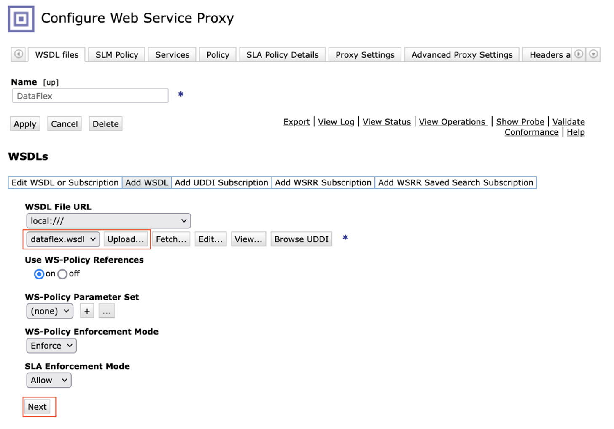

7. W kolejnym kroku należy skonfigurować punkty końcowe (endpoints) usługi:

- Lokalny (co widzi klient): lokalny moduł obsługi punktu końcowego, URI wysyłane przez klienta.
- Zdalny (gdzie naprawdę znajduje się usługa internetowa): Punkt końcowy usługi internetowej (protokół, nazwa hosta, port i identyfikator URI).

8. W pierwszej kolejności skonfigurujesz „Local Endpoint Handler” (inaczej Front Side Handler – FSH), gdzie określmy lokalny adres IP i numer portu do nasłuchiwania zapytań. Kliknij znak **+**, a następnie wybieramy **HTTP Handler**.

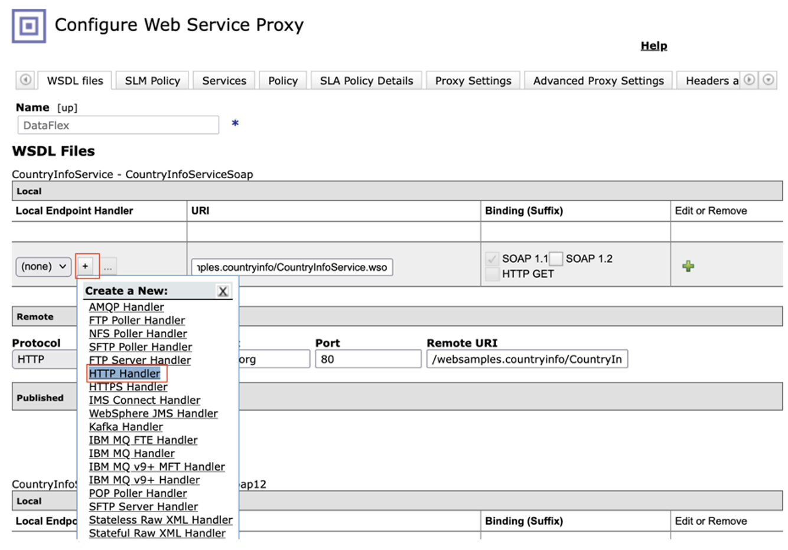

9. Zmień następujące pola konfiguracji FSH (pozostałe pozostawiamy bez zmian):

- Name: `DataFlex_FSH_8003` (dobra praktyka podpowiada, aby FSH nazywać od nazwy usługi oraz portu jaki wykorzystuje FSH).
- Comments (opcjonalnie): `FSH for DataFlex Service`
- Local IP address: `0.0.0.0 `(jest to ustawienie domyśle, gdzie FSH nasłuchuje na wszystkich adresach IP dostępnych w ramach DP)
- Port: `8003`
- Allowed methods and versions: `pierwsze 5 metod oraz URL with ? oraz #`

10. Reszta konfiguracji pozostaje bez zmian. Konfiguracja FSH powinna wyglądać następująco:

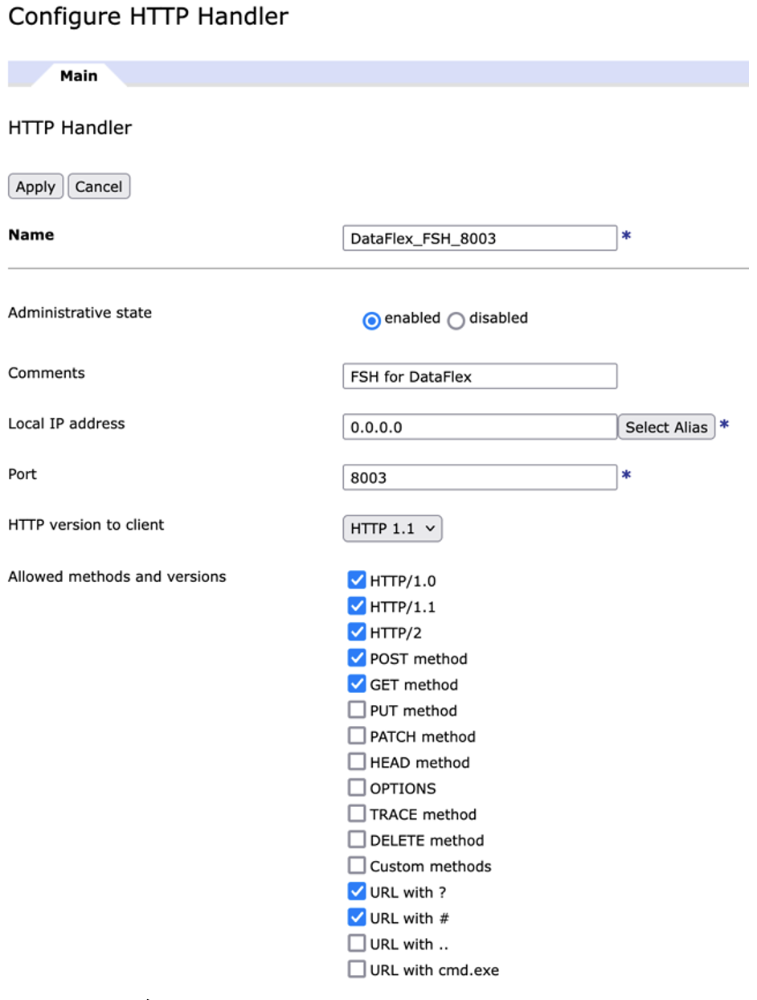

11. Kliknij `Apply`, aby zapisać wprowadzoną konfiguracje.
12. Wybierz przed chwilą skonfigurowany FSH, URI pozostawiamy bez zmian, a następnie kliknij zielony znak **+**.

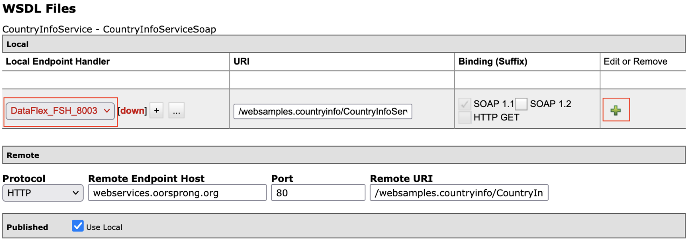

13. Dla drugiego binding’u (SOAP 1.2) również wybierz stworzony wcześniej FSH i kliknij zielony **+**. 
14. Poprawnie skonfigurowany usługa powinna wyglądać następująco

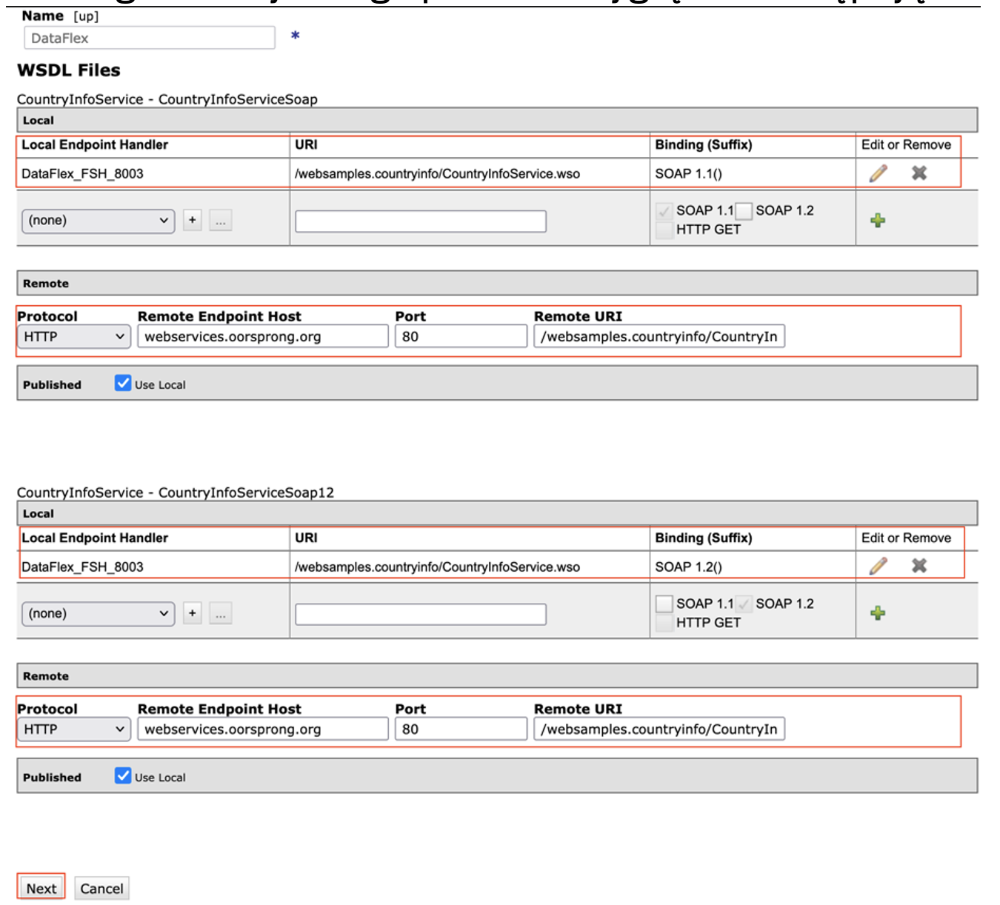

15. Następnie kliknij `Next` (dolna część ekranu).
16. Zapisz zmiany klikając `Save Configuration` (prawy górny róg).

Na ten moment mamy wstępnie skonfigurowaną usługę WS-Proxy dla serwisu DatFlex.

> [!NOTE]
> Serwis DataFlex posiada szereg operacji pozwalających wydobyć dane dt. różnych krajów z wykorzystaniem protokół komunikacyjny SOAP. Usługę będziemy testować poprzez wysyłanie zapytań z wykorzystaniem narzędzia SoapUI.

### Test usługi WS-Proxy

1. Otwórz program **SoapUI** poprzez kliknięcie ikony aplikacji dostępnej z Pulpitu. Projekt SOAP jest już skonfigurowany pod nazwa **DataFlex**.
2. Aby przetestować stworzona usługę rozwiń pierwszą operację `CapitalCity`, a następnie podwójnym kliknięciem otwórz `Request 1`.

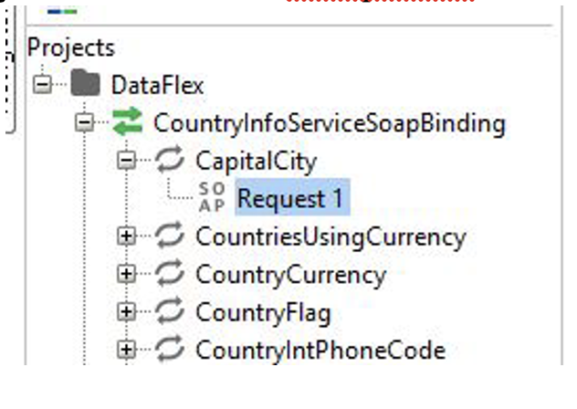

3. Dodaj endpoint odpowiadający skonfigurowanej usłudze WS-Proxy zgodnie z:

`http://<DP_IPaddress>:<FSHport>/websamples.countryinfo/CountryInfoService.wso`

Dla przykładu: `http://192.168.226.129:8003/websamples.countryinfo/CountryInfoService.wso`

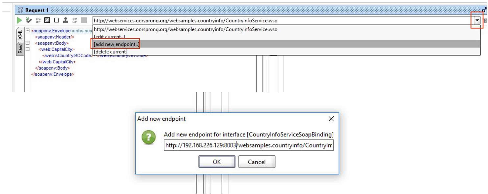

4. Następnie wpisz `PL` w miejsce `?` oraz kliknij przycisk `Play`.

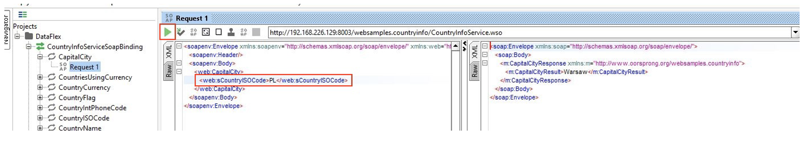

5. W odpowiedzi powinieneś dostać stolice Polski: **Warsaw**. Świadczy to o dobrze przeprowadzonej wstępnej konfiguracji usługi oraz działającej serwerze końcowym.

### SLM Policy

W kolejnym kroku skonfigurujesz politykę SLM, która ogranicza ilość wysyłanych zapytań do usługi DataFlex. Dzięki temu możemy ograniczyć ruch i obciążenie serwera końcowego.

1. Wróć do WebGUI DP i usługi WS-Proxy `DataFlex`.
2. Kliknij kartę **SLM Policy**. Konfiguracja polityka SLM Policy pozwoli monitorować zapytania trafiające do WS-Proxy.

> [!NOTE]
> SLM Policy pozwala na:
> - Zapewnia monitorowanie na różnym poziomie usługi.
> - Kontrolowanie ruch przychodzący do WS-Proxy za pomocą akcji Notify, Throttle oraz Shape.
> - Wyświetlanie wykresu, aby zobaczyć ruch sieciowy na danym poziomie.
>
> W obszarze Request możesz policzyć liczbę transakcji występujących w określonym przedziale czasu (w sekundach). W przypadku przekroczenia limitu transakcji możesz określić następujące akcję:
>
> - **Notify**: Generuje komunikat do logu w przypadku przekroczenia limitu transakcji.
> - **Throttle**: Wszystkie transakcje powyżej limitu są odrzucane i generowane są komunikat do logu.
> - **Shape**: Pierwsze 2500 transakcji przekraczających limit transakcji trafia do kolejki do późniejszej transmisji, a kolejne transakcje przekraczające limit 2500 są odrzucane. Generowane są komunikat do logu.
> W obszarze Failure możesz określić te same informacje, co Request, z tą różnicą, że te ustawienia dotyczą komunikatów o błędach.

3. Rozwiń drzewo WSDL, aż do operacji **CapitalCity** (`proxy: DataFlex --> wsdl: dataflex.wsdl --> service: CountryInfoServiceSoap --> port-operation: CapitalCity`)

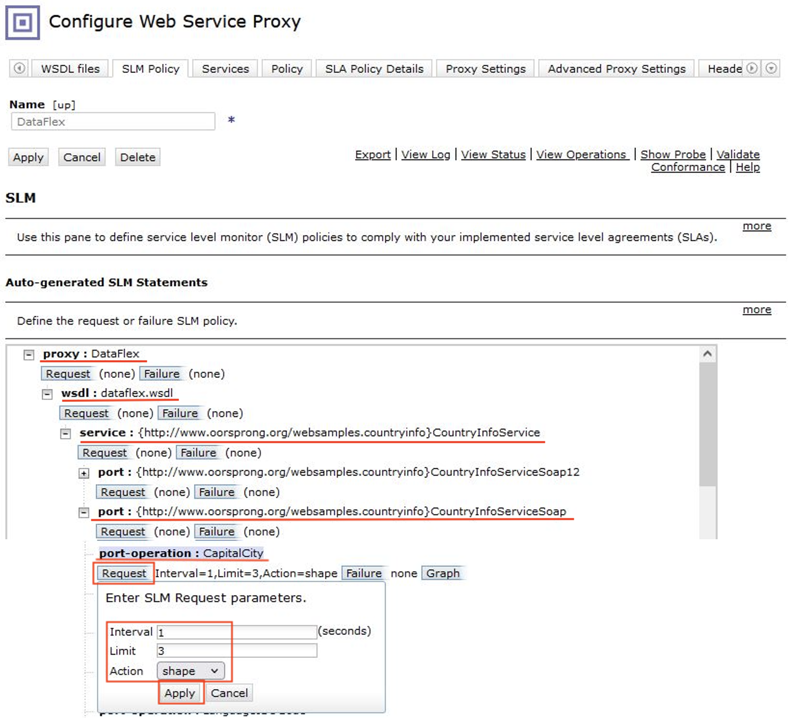

4. Następnie kliknij na `Request`, aby zdefiniować politykę SLM.
5. Ustaw następujące wartości:

- Interval: `1`
- Limit: `3`
- Action: `Shape`

6. A następnie kliknij `Apply` oraz `Apply` i `Save Configuration` dla usługi.

Następująca polityki pozwala wysłać 3 zapytania o stolicę kraju w ciągu 1 sekundy. Zapytania powyżej tego limitu trafią do kolejki do późniejszej transmisji.

### Test SLM Proxy

1. Przetestujesz zadaną politykę. W tym celu przejdź do już otwartego narzędzia SoapUI.
2. Rozwiń zakładkę **CountryInfoServiceSoapBinding TestSuite**, a następnie kliknij prawym przyciskiem myszy na zakładkę `Load Tests` i `New LoadTest`. Nazwij go `SLM_Policy_Test`. 

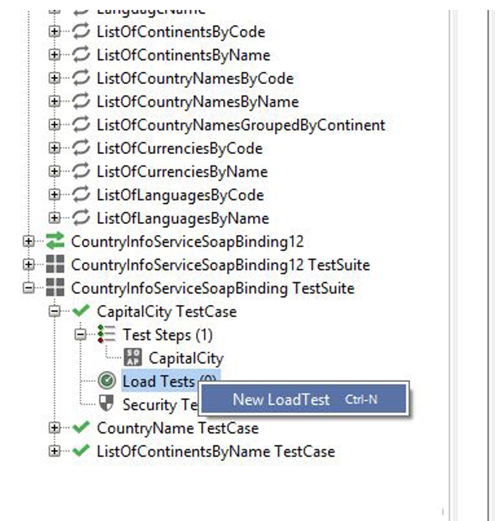

> [!WARNING]  
> w zakładce Test Steps sprawdź, czy zapytanie jest tożsame z zapytaniem testowym z poprzedniego zadania (**IP adres, port oraz CountryISOCode**).

3. Ustaw następujące parametry testu:

- Threads: `1`
- Strategy: `Simple`
- Test Delay: `100`
- Random: `0`
- Limit `60 seconds`

4. Puść test klikając `Play`. Przeanalizuj statystyki testu. W ciągu minuty testu przeszło 181 zapytań (*cnt*) co daje 3 zapytania na sekundę (*tps*). Wyniki testu potwierdziły skuteczność zadanej polityki.

5. Wróć do WebGUI DP i kliknij `Graph`, aby przeanalizować ruch. Widzimy rozkład zapytań w czasie.

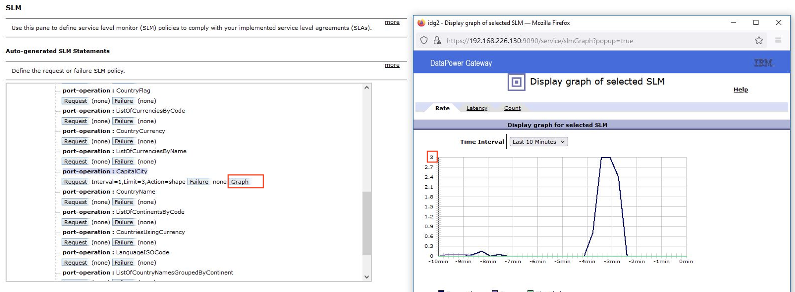

### Proxy Setting – Authorization AAA Policy

1. W tym zadaniu zajmiesz się stworzeniem nowej polityki AAA, która będzie zastosowana dla wszystkich zapytań w ramach usługi WS-Proxy **DataFlex**. Polityka AAA można również zastosować na różnym poziomie usług w zakładce Policy.

> [!NOTE]
> AAA oznacza 3 procesy bezpieczeństwa:
> 1.	**Autentykacja** (Uwierzytelnianie) weryfikuje tożsamość nadawcy zapytania.
> 2.	**Autoryzacja** określa, czy klient ma dostęp do żądanego zasobu.
> 3.	**Audyt** rejestruje wszelkie próby uzyskania dostępu do zasobów.

2. Aby zdefiniować politykę dla naszego WS-Proxy przejdź do zakładki **Proxy Settings**.
3. Stwórz nową politykę AAA klikając znak `+` przy opcji `Authorization AAA Policy`.

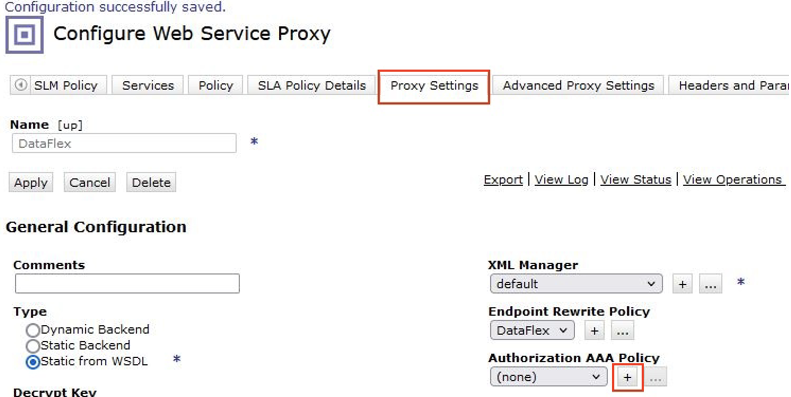

4. W zakładce **main** należy uzupełnić nazwę polityki Name: `AAA_Policy`.
5. Przejdź do zakładki **Identity extraction**, gdzie wybierz metodę `HTTP Authentication header`.

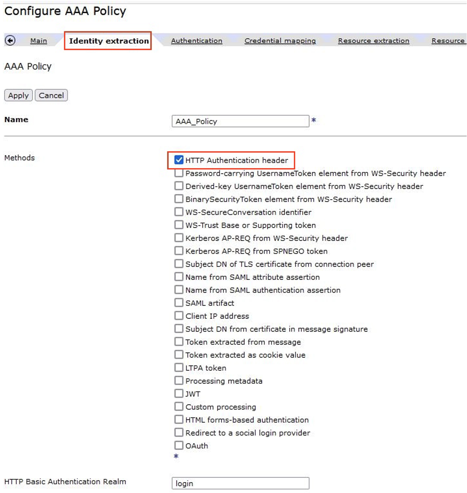

6. Przejdź do następnej zakładki **Authentication**, gdzie skonfigurujesz metodę uwierzytelnienia.
7. Wybierz `Use AAA information file` (jest to metoda, gdzie klient jest uwierzytelniany z wykorzystaniem pliku XML dostępnego w IDG).Przykładowy plik `AAAInfo.xml`, znajduje się w lokalnej lokalizacji `store:///`
8. Możesz podejrzeć zawartość pliku klikając `View…`

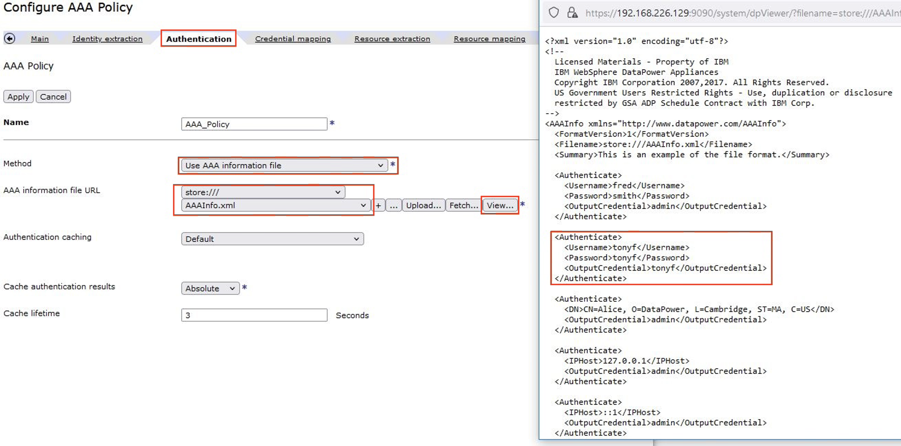

9. Należy również skonfigurować ustawienia w zakładce **Resource extraction**, gdzie zaznacz opcję `URL sent by client`.
10. Dodatkowo skonfiguruj licznik żądania dostępu, aby zapobiec atakowi słownikowemu.

> [!NOTE]
> Ataki słownikowe są wykrywane poprzez wielokrotnie odrzucane prośby o dostęp, co zazwyczaj jest widocznym objawem wykorzystania słownik zawierający popularne lub potencjalne hasła, aby uzyskać nieautoryzowany dostęp do konta lub systemu. Usługa DataPower może monitorować żądania dostępu poprzez akcję AAA, która jest aktywowana przy każdym żądaniu usługi. Gdy liczba odrzuconych żądań dostępu osiągnie określony poziom, usługa może wysłać powiadomienie, a nawet odmówić usługi na pewien czas.

11. Kliknij na zakładkę **main**, a następnie kliknij `Reject Counter Tool`.
12. Ustaw następujące wartości jak na załączonym obrazku:

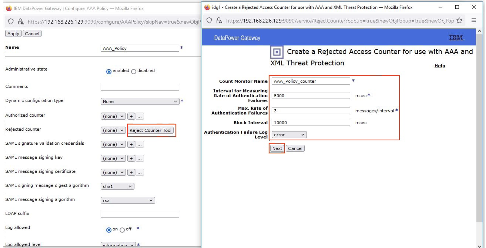

13. Następnie kliknij `Next`, `Commit` i na końcu `Done`.
14. W ostatnim kroku kliknij `Apply`, aby potwierdzić konfigurację polityki.
15. Aby zapisać wprowadzone zmiany kliknij `Apply` oraz `Save Configuration`.
16. Pozostaje jeszcze skonfigurować monitor wystąpień (**Count Monitor**). W tym celu kliknij na zakładkę **Monitors**, a następnie wybierz stworzony wcześniej `AAA_Policy_counter` i kliknij ikonę `...`, aby wprowadzić dodatkową konfigurację.

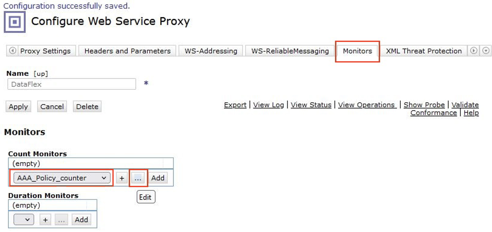

17. Zmień pole **Measure** na `Errors` oraz **Source** na `Each IP`, a następnie kliknij `Apply`.

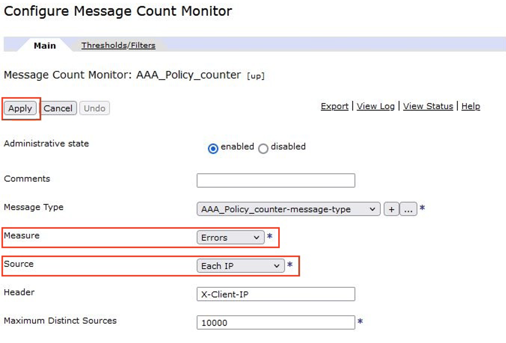

18. Następnie kliknij `Add`.

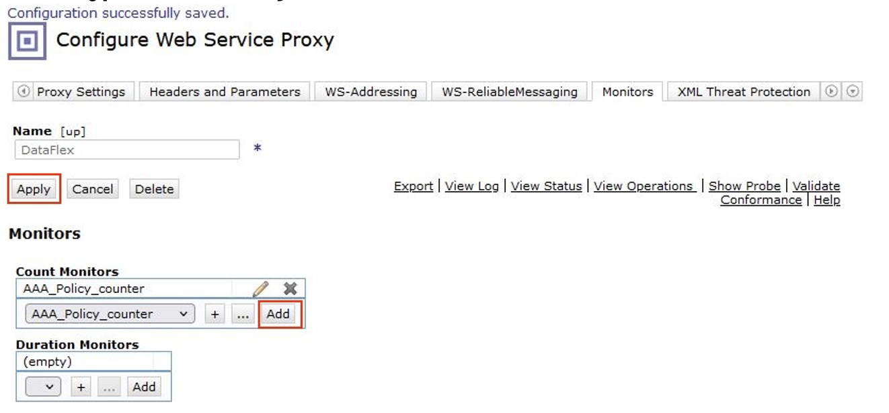

19. Aby zapisać wszystkie zamiany kliknij `Apply` oraz `Save Configuration`.

### Test AAA Policy

1. Skonfigurowana polityka AAA wymaga od klienta uwierzytelnienia zgodnie z plikiem `AAAInfo.xml`. Jednym ze skonfigurowanych użytkowników jest użytkownik:

```
Login: tonyf
Hasło: tonyf
```
2. Wykorzystasz podany login i hasło do testów. Skonfigurowany licznik żądań dostępu pozwala na max. 3 błędne logowania w ciągu 5 sekund. Przekraczając ten limit będzie 10 sekundowa przerwa uniemożliwiająca ponowne uwierzytelnienie.
3. Aby przetestować politykę, skorzystasz z narzędzia SoapUI. Przejdź do narzędzia.
4. Rozwiń zakładkę **CountryInfoServiceSoapBinding**, a następnie **ListOfContinentByName**. Kliknij 2 razy na **Request 1**, aby pojawiło się okno z zapytaniem.
5. Zmień adres zapytania na wcześniej skonfigurowany adres DP.
6. Puść test klikając `Play`. Zapytanie zostało odrzucone zgodnie z przewidywaniami, a powodem był brak uwierzytelnienia (kod błędu `401`).

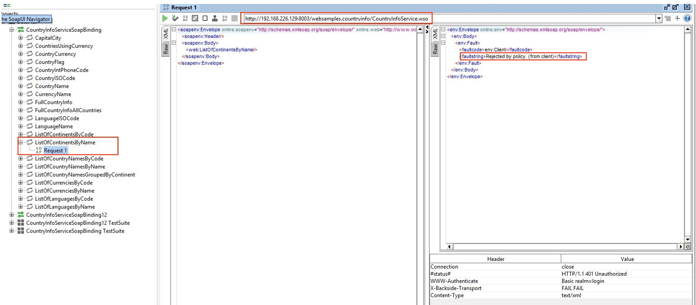

7. Dodaj do zapytania proste uwierzytelnienie, aby to zrobić kliknij **Auth** (lewy dolny róg okna zapytania), a następnie rozwiń zakładkę **Authorization** i wybierz `Add New Authorization`.

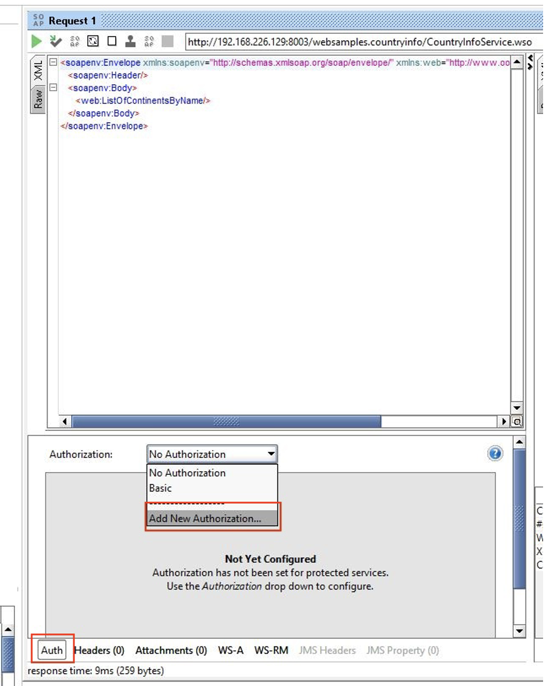

8. Wybierz typ uwierzytelnienia jako `Basic`.

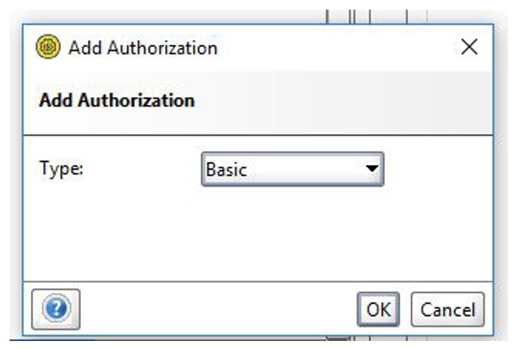

9. Pojawi się możliwość wpisania loginu i hasła. Wpisz je, odpowiednio **Username**: `tonyf` i **Password**: `tonyf` (resztę pól pozostaw bez zmian).
10. Kliknij `Play`, aby przetestować uwierzytelnienie. Tym razem powinieneś otrzymałeś odpowiedź.

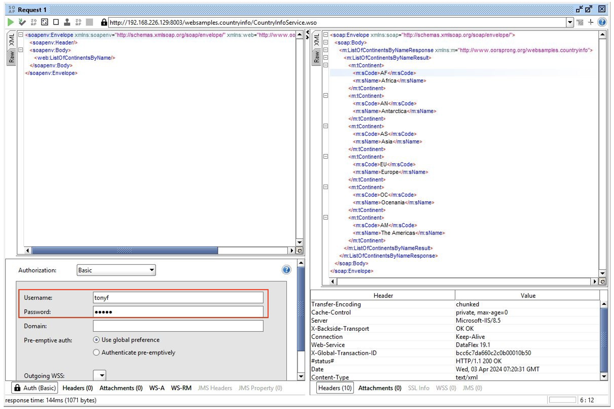

11. Aby przetestować zabezpieczenie ataku słownikowego, należy uruchomić wysłanie zapytania z błędnym logiem lub hasłem 3 razy w ciągu 5 sekund. Usuń ostatnią literę w loginie i puść zapytanie ponad 3 razy w ciągu 5s. Powinieneś otrzymać komunikat błędu lub połączenie do usługi zostanie odrzucone przez następne 10s, co uniemożliwia ponowne uwierzytelnienie i dostęp do usługi.
12. Aby sprawdzić poprawność działania polityki i zabezpieczenia ataku słownikowego można sprawdzić logi systemowe. W tym celu przejdź na `Control Panel` WebGUI i kliknij `View Logs`.
13. W dzienniku logów widać komunikaty błędu mówiące o odrzuceniu zapytania z powodu polityki AAA oraz wywołanie licznika odrzucającego ponowną możliwość uwierzytelnienia.

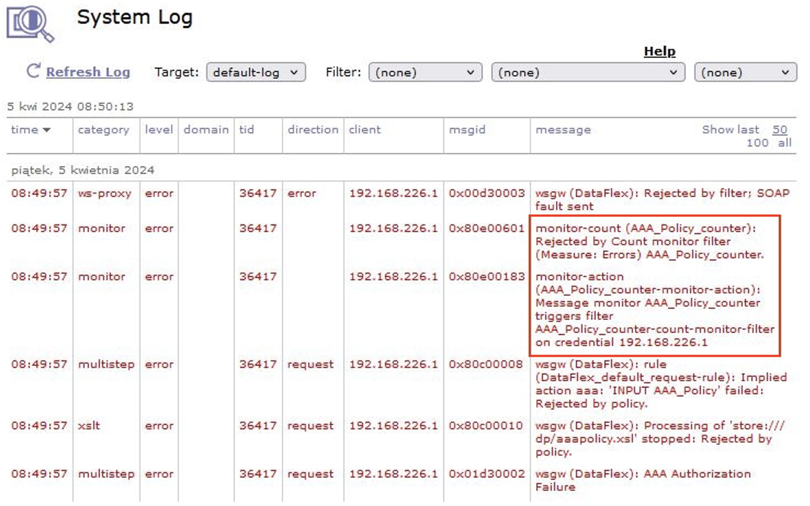

### Ochrona przed atakiem SQL Injection

> [!NOTE]
> SQL Injection to jedna z dość częstych i jednocześnie niebezpiecznych podatności w aplikacjach webowych. Już sama nazwa wskazuje na rodzaj problemu – atakujący wstrzykuje do aplikacji (nieautoryzowany) fragment zapytania SQL. Wstrzyknięcie zazwyczaj możliwe jest z jednego powodu – braku odpowiedniego sprawdzenia (walidacji) parametru przekazanego przez użytkownika. Taki parametr, gdy mamy do czynienia z SQL injection, często przekazywany jest bezpośrednio do zapytania SQL. Może to skutkować wieloma groźnymi sytuacjami tj.:
> - nieautoryzowanym dostępem w trybie odczytu lub zapisu do całej bazy danych,
> - możliwością ominięcia mechanizmu uwierzytelnienia,
> - możliwością odczytania wybranych plików (system operacyjny, na którym pracuje baza danych),
> - możliwością tworzenia plików w systemie operacyjnym, na którym pracuje baza,
> - możliwością wykonania kodu w systemie operacyjnym (uprawnienia użytkownika, na którym pracuje baza lub web serwer – w przypadku aplikacji webowych).
>
> Źródło: https://sekurak.pl/czym-jest-sql-injection/

1. DataPower pozwala zabezpieczyć usługi na wypadek ataku **SQL Injection**. W tym ćwiczeniu zaimplementujesz tą funkcjonalność dla jednej z operacji usługi WS-Proxy.

> [!WARNING]  
> Zanim przejdziemy do ćwiczenia, należy wyłączyć politykę AAA, aby sprawniej testować funkcjonalność. Aby to zrobić zmień w zakładce **Proxy Settings** politykę AAA na (none), a następnie klikjnij `Apply` oraz `Save Configuration`.

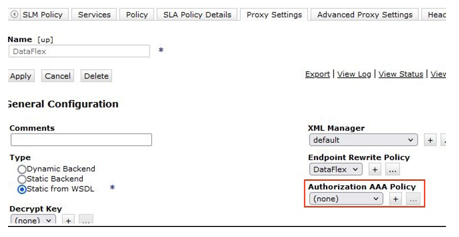

2. Kliknij na zakładkę **Policy**, a następnie rozwiń drzewo WSDL, aż do operacji **CountryName** (`proxy: DataFlex --> wsdl: dataflex.wsdl --> service: CountryInfoServiceSoap --> port-operation: CountryName`)
3. Kliknij `Processing Rules` dla operacji **CountryName**. Na dole pojawi się okno `Policy Configuration`.

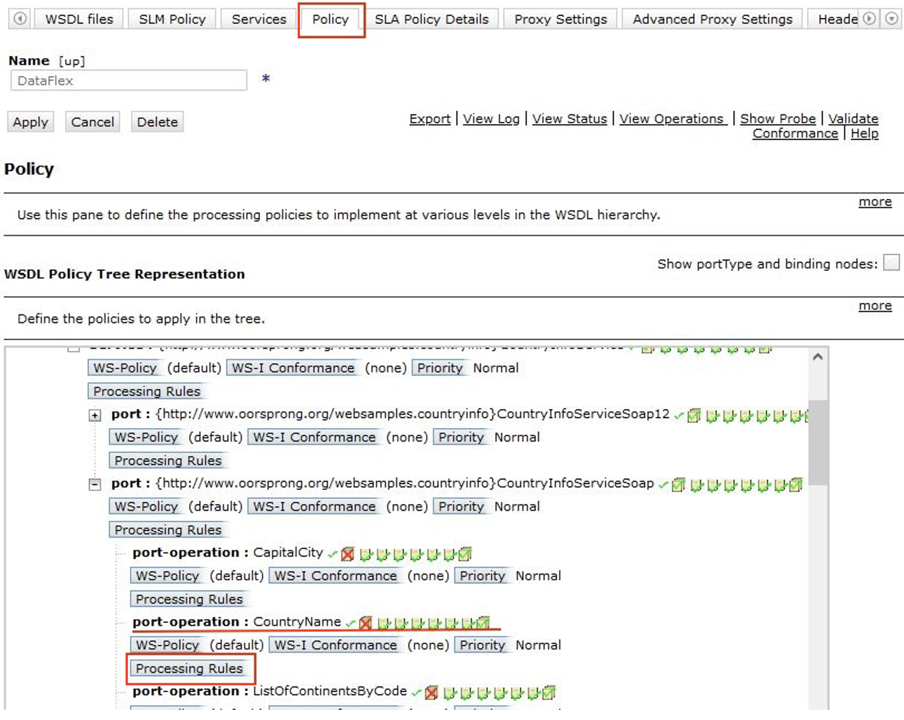

4. Aby zabezpieczyć usługę przed atakiem *SQL injection* wykorzystasz podejście oparte na arkuszach stylów w celu odfiltrowania potencjalnie ryzykownych ciągów SQL’owych. Zrobisz to dodając regułę z funkcją filtra.
5. W polu **Rule Direction** wybierz opcje `Both Direction` i kliknij `New Rule`, w polu **Rule Name** wpisz nazwę zasady `SQLinjection_rule`.
6. Przeciągamy regułę `Filter` w miejsce tak jak na załączonym obrazku.

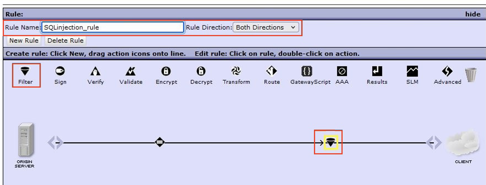

7. Dwukrotnie kliknij na ikonę filtra, aby otworzyć konfiguracje.
8. W bazie danych DP istnieje już skonfigurowany plik filtrujący, który chroni przed atakiem *SQL Injection*. Można go znaleźć w lokalizacji `store:///SQL-Injection-Filter.xsl`.

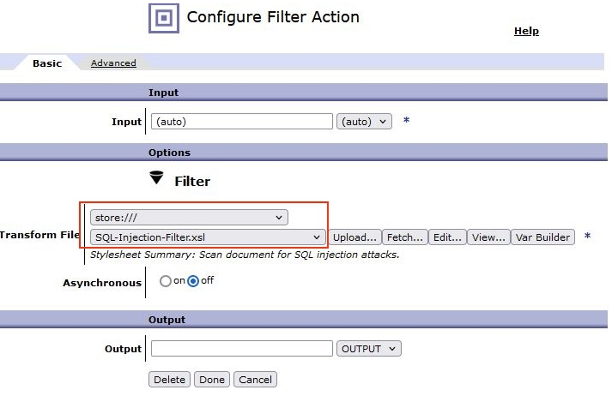

> [!NOTE]
> Można stworzyć swój własny plik ze wzorami SQL, które chcemy filtrować. W tym celu można wykorzystać szablon dostępny w ramach DP z `store:///SQL-Injection-Patterns.xml`

9. Wybierz odpowiedni plik, a następnie kliknij `Done`.
10. Kliknij `Apply`, a następnie `Save Configuration`.

### Test filtra przed atakiem SQL Injection

1. Przetestujesz skonfigurowany filtr. W tym celu przejdź do narzędzia SoapUI.
2. Rozwiń zakładkę **CountryInfoServiceSoapBinding**, a następnie **CountryName**. Kliknij 2 razy na **Request 1**, aby pojawiło się okno z zapytaniem.
3. Zmień adres zapytania na wcześniej skonfigurowany adres DP.
4. Następnie wpisz `PL` w miejsce `?` oraz kliknij przycisk `Play`.

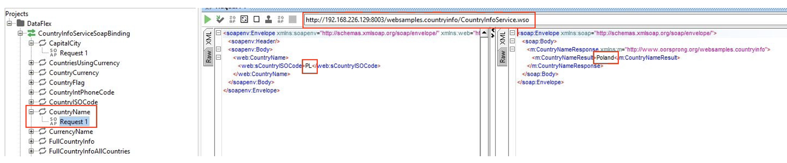

5. W odpowiedzi dostaniesz nazwę kraju: **Poland**.
6. Teraz spróbuj wpisać `select` (słowo funkcyjne w SQL) w miejsce `PL` oraz kliknij `Play`.
7. Powinieneś otrzymać informacje, że komunikat zawiera zwrot zastrzeżony i został odrzucony z błędem `500`.

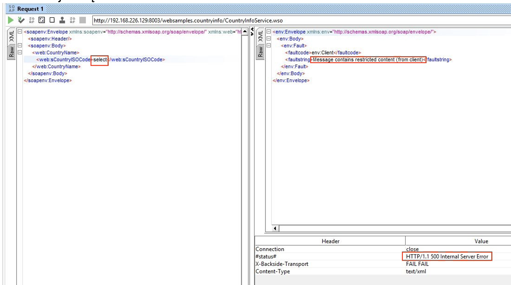

8. Sprawdź jeszcze jakie komunikaty widnieją w logu WS-Proxy.
9. W WebGUI DP będąc w usłudze **DataFlex** kliknij **View Log**.
10. W dzienniku logów powinieneś zobaczyć komunikaty błędu mówiące o odrzuceniu zapytania z powodu zastosowania filtra *SQL Injection*.

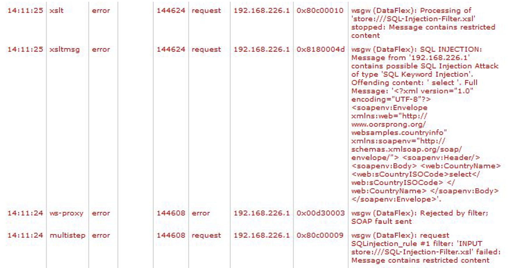
