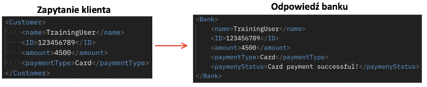
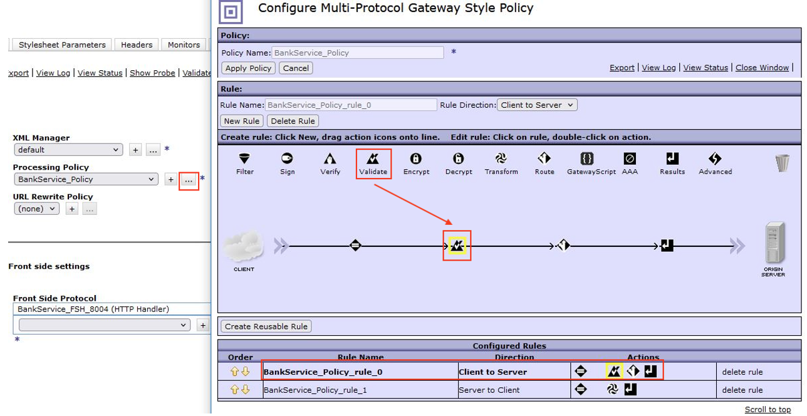
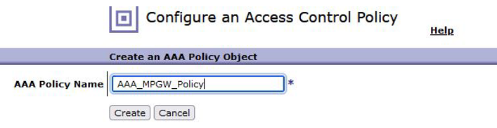
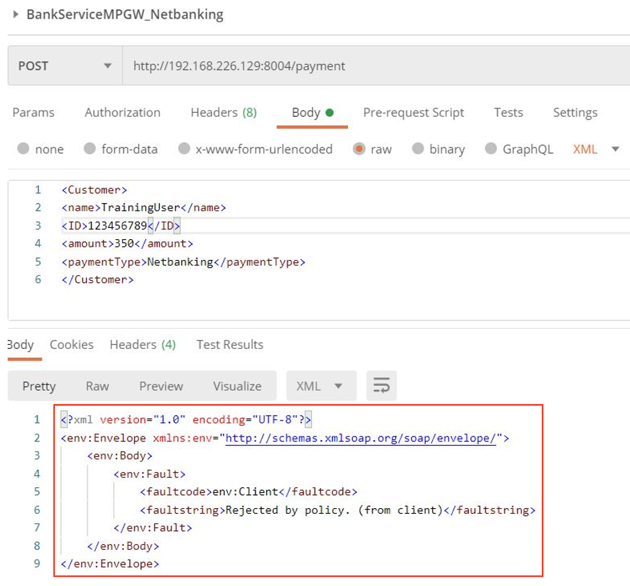

# Usługa Multi-Protocol Gateway IDG

Celem tego ćwiczenia jest poznanie usługi Multi-Protocol Gateway (MPGW) oraz podstawowa konfiguracja następujących funkcji:

- Dynamic-backend (routing).
- Zabezpieczenia na poziomie FSH.
- Transform with XSLT style sheet.
- XML Schema Validation.
- AAA Policy.
- DataPower Gateway Script.

Podczas tego ćwiczenia skonfigurujemy usługę MPGW o nazwie MPGW_BankService, której celem będzie przekierowanie zapytania do odpowiedniego serwisu back-end’owego, który zwróci odpowiedź w zależności od zapytania. Podczas tworzenia usługi MPGW będziemy sukcesywnie dodawać kolejne reguły i zabezpieczenia usługi.

## Dostęp do plików i katalogów na laptopie

Wszystkie pliki wymagane do wykonania tego ćwiczenia znajdują się w następującym folderze lokalnym:

`C:\DataPowerAdminTraining\Lab7`

## Podstawowa konfiguracja MPGW

1. Przed rozpoczęciem ćwiczeń zmień domenę na `Developer`.
2. Wybierze ikonę *Multi-Protocol Gateway* na panelu głównym WebGUI DataPower, a następnie kliknij `Add`, aby dodać nową usługę.
3. Uzupałnij następujące dane:

- Wprowadź nazwę usługi (Name): `MPGW_BankService`
- Typ (Type): `dynamic-backends`
- Typ zapytania (Request Type): `XML`
- Typ odpowiedzi (Response Type): `XML`

4. W kolejnym kroku skonfiguruj *Frond Side Protocol*, gdzie określisz lokalny adres IP i numer portu do nasłuchiwania zapytań. Kliknij znak `+`, a następnie wybierz `HTTP Handler`.

5. Zmieniamy następujące pola konfiguracji FSH (pozostałe pozostawiamy bez zmian):

- Name: `BankService_FSH_8004`.
- Comments (opcjonalnie): `FSH for BankService`
- Local IP address: `0.0.0.0` (jest to ustawienie domyśle, gdzie FSH nasłuchuje na wszystkich adresach IP)
- Port: `8004`
- Allowed methods and versions: `pierwsze 5 metod oraz URL with ? oraz #`
- Maximum request headers: `4`

Ostatni parametr określa maksymalną ilość nagłówków w zapytaniu. Na późniejszym etapie ćwiczenia przetestujemy działanie tego zabezpieczenia.

6. Reszta konfiguracji pozostaje bez zmian. Konfiguracja FSH powinna wyglądać następująco:

7. Kliknij `Apply`, aby zapisać wprowadzoną konfiguracje.
8. W kolejnym kroku należy skonfigurować politykę przetwarzania, aby to zrobić kliknij ikonę `+` przy zakładce **Processing Policy**.

9. Nazwij politykę (**Policy Name**): `BankService_Policy` i kliknij `Apply Policy`.
Następnie kliknij `New Rule` i zmień **Rule Direction**: `Client to Server`.
10. Kliknij dwukrotnie na ikonę akcji `Match`, aby skonfigurować regułę.

11. Następnie kliknij ikonę `+`.

12. Nazwij regułę (**Name**): `BankService_MatchRule`

13. Kliknij `Add`, a następnie wpisz:

- Matching type: `URL`
- URL match: `/payment`

14. Kliknij `Apply`. Ponownie kliknij `Apply`, a następnie `Done`.
15. W następnym kroku dodaj akcję **Route** i kliknij w nią dwukrotnie, aby skonfigurować dynamiczny wybór usługi backend’owej.

16. Aby zdefiniować, gdzie ma zostać przekazane zapytanie wykorzystamy XPath Expression, w tym celu zmień metodę na `Use XPath to Select Destination`, a następnie kliknij `+`, aby skonfigurować mapę routingu.

17. Wpisz nazwę (**Name**): `BankService_RoutingMap`, a następnie przejdź do zakładki **Rules**.
18. Kliknij `Add`, aby zdefiniować regułę, następnie kliknij `XPath Tool`.

19. Aby zdefiniować regułę wykorzystasz przykładowe zapytanie, które będzie wysyłane do pierwszego serwisu. Wybierz (**Upload…**) zapytanie `request1.xml` dostępne w folderze `C:/DataPowerAdminTraining/Lab7`, a następnie kliknij `Upload`.

20. Zapytanie pojawi się w dolnej części okna. Pierwszy system backend przetwarza zapytania dt. płatności karta (**Card**). Informacja dt. typu płatności (**paymentType**) determinuje, do którego serwisu powinno trafić zapytanie, dlatego klikamy **Card**.

21. Pojawiła się reguła, która sprawdza typ płatności i jeśli będzie to **Card** to zostanie spełniona. Klikamy `Done`.
22. W następnym kroku musimy zdefiniować adres IP usługi backend oraz port na której działa. Usługa jest zdefiniowana następująco:

- Remote Host: `<DP_IP_Address>` (Adres IP DataPower)
- Remote Port: `2050`

23. Kliknij `Apply`.

24. Dodaj następną regułę klikając `Add`.

25. Powtórz procedurę definicji reguły, tym razem z wykorzystaniem przykładowego zapytania (`request2.xml`) do drugiej usługi, który przetwarza zapytania dt. płatności internetowych (**Netbanking**). Adres IP oraz port drugiej usługi jest następujący:

- Remote Host: `<DP_IP_Address>` (Adres IP DataPower)
- Remote Port: `2051`

Definicja reguły jak na obrazku:

24. Kliknij `Apply`.
25. Poprawnie zdefiniowana mapa powinna wyglądać następująco:

26. Kliknij `Apply`.

25. Kliknij `Done`.
26. W następnym kroku musisz stworzyć regułę polityki z *Rule Direction*: `Server to Client`. Aby to zrobić kliknij `New Rule` i zmień **Rule Direction** na `Server to Client`.
27. Kliknij dwa razy na ikonę akcji Match, a następnie wybierz regułę `__default-accept-service-providers__`. Kliknij `Done`, a potem `Apply Policy` i zamknij okno.

28. Kliknij `Apply` i `Save Configuration`, aby zapisać konfiguracje MPGW.

## Test usługi MPGW_BankService

1. Przetestuj skonfigurowaną usługę. W tym celu przejdź do narzędzia **Postman**. Aplikacja jest dostępna z poziomu pulpitu.
2. Narzędzie ma już załadowaną kolekcje, gdzie znajdziesz przykładowe zapytania do usługi `MPGW_BankService`.

3. Wybierz zapytanie **BankServiceMPGW_Card**. Upewnij się, że adres IP zgadza się z adresem IDG, a następnie kliknij `Send`.

4. Otrzymałeś odpowiedz od serwisu backend’owego odpowiedzialnego za przetwarzanie zapytań dt. płatności kartą. Kliknij na zapytanie `BankServiceMPGW_Netbanking`. Ponownie upewnij się, że adres IP zgadza się z adresem IDG, a następnie kliknij `Send`.

5. Widać, że skonfigurowana usługa działa poprawnie i przekierowuje nasze zapytanie do serwera końcowego odpowiedzialnego za płatności internetowe.
6. Spróbuj teraz zmienić wartość w **paymentType** na `xyz` i kliknij `Send`.

7. Widać, że zadziałała reguła routingu, która nie znalazła odpowiedniej usługi backend. Wróć do wartości początkowej zapytania klikając `Ctrl+z`.

## Konfiguracja transformacji odpowiedzi z serwera z wykorzystaniem XSLT

Na ten moment usługa zwraca nam komunikat w formacie serwisu backend’oweg banku.

1. Odpowiedź powinna być w formacie klienta. W tym celu zastosujesz regułę transformacji w ramach IDG oraz prosty plik transformacyjny napisany w XSLT – `Bank2Customer.xls`, który dostępny jest w folderze `C:/DataPowerAdminTraining/Lab7`. Transformacja wygląda następująco:

2. Aby skonfigurować regułę wróć do WebGUI DP oraz usługi **MPGW_BankService**. Kliknij `…` przy polityce *BankService_Policy*, aby zmienić konfiguracje.
3. Przejdź do reguły **Server to Client**, a następnie przeciągnij akcję `Transformacji` za akcją `Match`

4. Kliknij dwukrotnie na akcje Transformacji, aby ją skonfigurować.
5. Wybierz `Transform with XSLT syle sheet`, a następnie załaduj plik transformacyjny `Bank2Customer.xls`. Po wybraniu pliku kliknij `Done`.

6. Zapisz wprowadzone zmiany klikając `Apply Policy`.
7. Kliknij `Apply` oraz `Save Configuration`.
8. Aby przetestować zmiany wróć do narzędzia **Postman**, a następnie kliknij `Send` wysyłając zapytanie `BankServiceMPGW_Netbanking`.

9. Widać, że odpowiedź została zmieniona na format klienta.

## Konfiguracja walidacji schematu XML

W kolejnej iteracji dododasz regułę sprawdzającą strukturę i typ danych wysyłanych w ramach zapytania XML. W tym celu wykorzystasz plik XSD definiujący poprawny schemat zapytania XML do usługi *MPGW_BankService*.

Plik `BankServiceSchemaValidation.xsd`, który znajduje się w folderze `C:/DataPowerAdminTraining/Lab7` definiuje, że:

- Nazwa użytkownika (**name**) ma być typu `string`
- **ID** użytkownika ma być typu `positiveInteger`
- Kwota (**amount**) ma być typu `decimal`
- Typ płatności (**paymentType**) ma być typu `string`

1. Aby skonfigurować regułę wróć do WebGUI DP oraz usługi **MPGW_BankService**. Kliknij `…` przy polityce *BankService_Policy*, aby zmienić konfiguracje.
2. Przejdź do reguły **Client to Server**, a następnie przeciągnij akcję `Walidacji` za akcją `Match`.

3. Kliknij dwukrotnie na akcje Walidacji, aby ją skonfigurować.
4. Wybierz `Validate Document via Schema URL`, a następnie załaduj plik walidacyjny `BankServiceSchemaValidation.xsd`. Po wybraniu pliku kliknij `Done`.

5. Zapisz wprowadzone zmiany klikając `Apply Policy`.
6. Kliknij `Apply` oraz `Save Configuration`.
7. Aby przetestować zmiany wróć do narzędzia **Postman**. Przejdź do zapytania `BankServiceMPGW_Netbanking`, a następnie zmiań ID użytkownika na `xyz`. 
8. Kliknij `Send`, aby wysłać wysłyłając zapytanie.

9. Wróć do WebGUI DP i kliknij `View Log`, aby sprawdzić przyczynę błędu.
10. Widać, że reguła walidacji zadziałała i pokazała, że `xyz` nie jest wartością typu `positiveInteger`.

## Konfiguracja polityki AAA w MPGW

1. Kolejnym zabezpieczeniem usługi będzie skonfigurowanie akcji AAA w ramach usługi MPGW. Podobnie jak w przypadku WS-Proxy wykorzystasz przykładowy plik `AAAInfo.xml`, który znajduje się w lokalnej lokalizacji `store:///` z już zdefiniowanymi użytkownikami.
2. Aby skonfigurować regułę wróć do WebGUI DP oraz usługi `MPGW_BankService`.
3. Kliknij `…` przy polityce *BankService_Policy*.
4. Przejdź do reguły **Client to Server**, a następnie przeciągnij akcję `AAA` za akcją `Match`.

5. Kliknij dwukrotnie na akcje `AAA`, aby ją skonfigurować.
6. Kliknij ikonę `+`, aby dodać nową politykę.

7. Nazwij politykę `AAA_MPGW_Policy` i kliknij `Create`.

8. Wybierz `HTTP Authentication header` i kliknij `Next`.
9. Wybierz metodę `Use AAA information file` i z lokalizacji `store:///` wybierz `AAAInfo.xml`, kliknij `Next`.

10. Wybierz `HTTP operation (GET or POST)` i kliknij `Next`.
11. Wybierz `Allow any authenticated client` i kliknij `Next`.
12. W następnej karcie pozostaw ustawienia bez zmian i kliknij `Commit`, a następnie `Done`.

13. Aby zakończyć konfiguracje kliknij `Done`.
14. Zapisz wprowadzone zmiany klikając `Apply Policy`.
15. Kliknij `Apply` oraz `Save Configuration`.
16. Aby przetestować zmiany wróć do narzędzia **Postman**.
17. Przejdź do zapytania `BankServiceMPGW_Netbanking`, a następnie kliknij `Send`, aby wysłać zapytanie.

18. Jak widać, zapytanie zostało odrzucone przez politykę.Dodaj metodę uwierzytelnienia *Basic Auth* w zakładce **Authorization** i wpisz:

- Username: `tonyf`
- Password: `tonyf`

19. Kliknij `Send`, aby wysłać zapytanie.

20. Tym razem polityka przepuściła zapytanie i otrzymałeś odpowiedz.

## Konfiguracja DataPower GatewayScript

W ostatnim zadaniu wykorzystasz GatewayScript, aby zmienić format odpowiedzi dla klienta z XML na format JSON oraz nagłówek informujący o typie odpowiedzi.

1. W tym celu wykorzystasz skrypt `DataPower_GatewayScript_XML2JSON.js` napisany w języku JavaScript:

2. Skrypt znajduje się w folderze `C:/DataPowerAdminTraining/Lab7`
3. Aby skonfigurować regułę wróć do WebGUI DP oraz usługi `MPGW_BankService`.
4. Kliknij `…` przy polityce *BankService_Policy*, aby zmienić konfiguracje.
5. Przejdź do reguły `Server to Client`, a następnie przeciągnij akcję `GatewayScript` za akcją `Transformacja`.

6. Kliknij dwukrotnie na akcje `GatewayScript`, aby ją skonfigurować.
7. Załaduj skrypt `DataPower_GatewayScript_XML2JSON.js`. Po wybraniu pliku kliknij `Done`.

8. Zapisz wprowadzone zmiany klikając `Apply Policy`.
9. Kliknij `Apply` oraz `Save Configuration`.
10. Aby przetestować zmiany wróć do narzędzia **Postman**, a następnie kliknij `Send` wysyłając zapytanie `BankServiceMPGW_Netbanking`.

11. Zgodnie z oczekiwaniami otrzymałeś odpowiedz w formacie JSON.
12. Na koniec pozostaje przetestować zabezpieczenie FSH, które ograniczało liczbę przesyłanych nagłówków w ramach zapytania. W tym celu kliknij na zakładkę **Headers** i dodaj nagłówek *User-Agent*, a następnie kliknij ~Send~.

13. Widać, że ograniczenie zadziałało. Sprawdź logi systemowe, aby zobaczyć komunikat.

