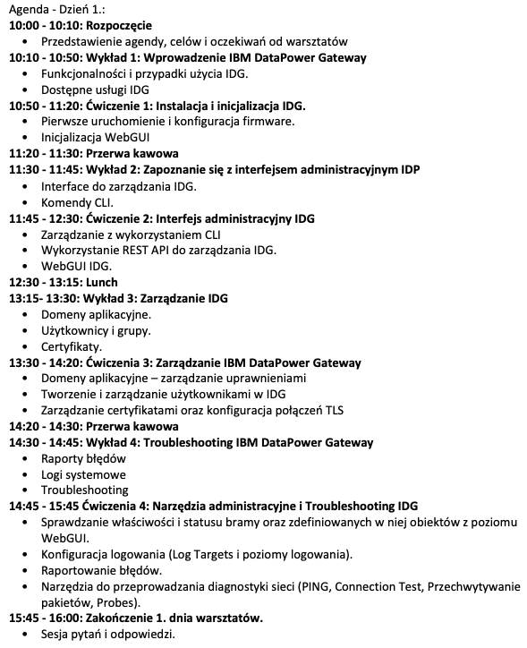
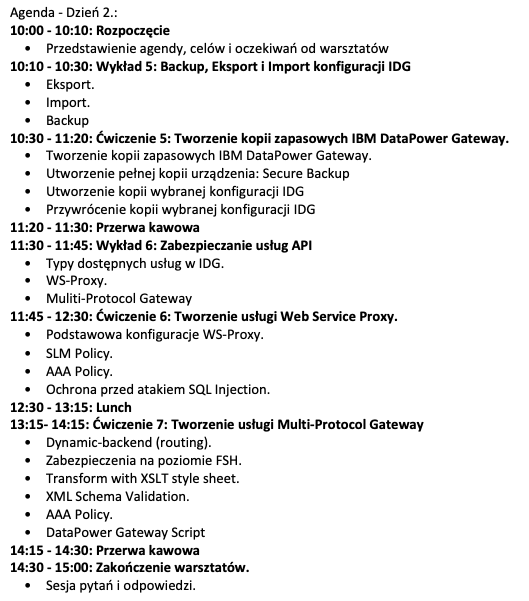

# Warsztaty z IBM DataPower Gateway dla administratorów.

### Środowisko Laboratoryjne

Skonfigurowane laptopy przekazane przez trenerów.

### Laboratoria:

1. [Lab1 - Instalacja i inicjalizacja bramki IDG](https://github.com/jawor96/Warsztaty_IDG/tree/main/Lab1)
2. [Lab2 - GUI IDG](https://github.com/jawor96/Warsztaty_IDG/tree/main/Lab2)
3. [Lab3 - Zarządzanie IDG](https://github.com/jawor96/Warsztaty_IDG/tree/main/Lab3)
4. [Lab4 - Narzędzia administracyjne i trobleshooting IDG](https://github.com/jawor96/Warsztaty_IDG/tree/main/Lab4)
5. [Lab5 - Kopia, Eksport, Import](https://github.com/jawor96/Warsztaty_IDG/tree/main/Lab5)
6. [Lab6 - Usługa WS-Proxy IDG](https://github.com/jawor96/Warsztaty_IDG/tree/main/Lab6)
7. [Lab7 - Usługa Multi-Protocol Gateway IDG](https://github.com/jawor96/Warsztaty_IDG/tree/main/Lab7)

## Agenda

### Dzień 1.

### Dzień 2.

### Prezentacje

[Prezentacje do pobrania](https://github.com/jawor96/Warsztaty_IDG/tree/main/Prezentacje).

### Kontakt

Mikołaj Jaworski

E-mail: mikolaj.jaworski2@ibm.com